# Instant Snapshots, Zero-Copy Clones: A Deep Dive into Cube's Snapshot, Clone, and Rollback Mechanisms

If you've run Cube Sandbox v0.3.0 on an ordinary Linux server, you may have noticed a few counterintuitive phenomena: disk snapshots that finish in a "split second" — issuing a snapshot command against a sandbox with tens of GiB of filesystem data returns almost instantly, without writing gigabytes to disk. Memory snapshots that write only a "fraction" of pages — for a sandbox running large-model inference and occupying tens of GiB of guest RAM, the data written during frequent checkpoints is significantly smaller than the guest's actual memory footprint. Snapshots no longer mean dumping the entire RAM to disk. "Zero-copy" cloning — forking 10 independent copies from a running sandbox in a single operation adds almost no disk usage, yet each copy can read and write in its own memory and filesystem without interfering with the others.

These "seemingly magical" phenomena are really underpinned by three interlocking low-level mechanisms. This article takes each of these three puzzles as a starting point and peels back the layers to reveal the core principles behind the snapshot, clone, and rollback capabilities in v0.3.0.

## Introduction: Three Surprising Phenomena

If you've run Cube Sandbox v0.3.0 on an ordinary Linux server, you may have noticed a few counterintuitive phenomena:

- **"Split-second" disk snapshots**: Issuing a snapshot command against a sandbox with tens of GiB of filesystem data returns almost instantly, without writing gigabytes to disk.
- **Memory snapshots that write only a "fraction" of pages**: For a sandbox running large-model inference and occupying tens of GiB of guest RAM, the data written during frequent checkpoints is significantly smaller than the guest's actual memory footprint. Snapshots no longer mean dumping the entire RAM to disk.
- **"Zero-copy" cloning**: Forking 10 independent copies from a running sandbox in a single operation adds almost no disk usage, yet each copy can read and write in its own memory and filesystem without interfering with the others.

These "seemingly magical" phenomena are really underpinned by three interlocking low-level mechanisms. This article peels back the layers to reveal the core principles behind v0.3.0's snapshot, clone, and rollback capabilities.

## 1. The Entry Point: Three Puzzles and a Five-Layer Architecture

The complexity of the entire snapshot/clone/rollback system stems from one fact — **VM State = Disk + Memory**, and the two must be captured, restored, and replicated consistently. Cube Sandbox decomposes this into two independent yet cooperative subsystems:

- **Disk Subsystem**: A file-level CoW engine built on XFS reflink.
- **Memory Subsystem**: Building on the traditional hypervisor snapshot framework with the addition of pagemap_anon and soft-dirty true-incrementals.

These subsystems span five layers of calls:

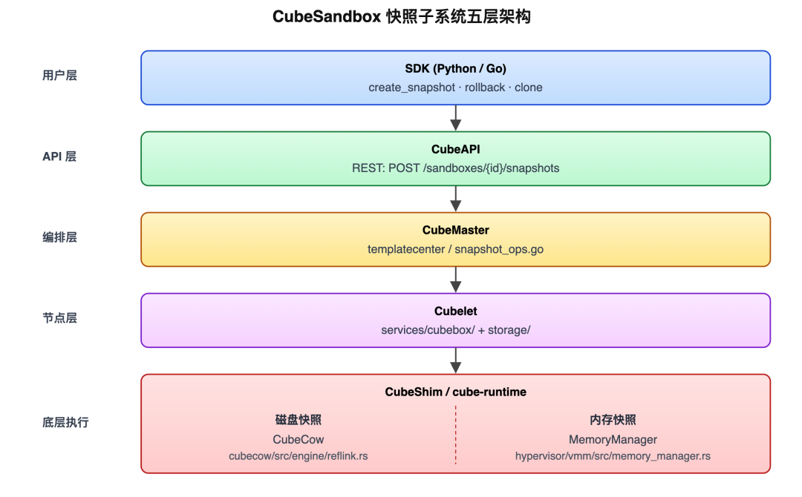

After reading the next three chapters, the three puzzles from the introduction will resolve into three clear kernel mechanisms:

| Puzzle | Core Mechanism |
| --- | --- |
| "Split-second" disk snapshots | XFS Reflink + FICLONE ioctl |
| "Fractional" memory writes | /proc/self/pagemap + soft-dirty bit55 |
| "Zero-copy" cloning | Decomposing clone(n) into snapshot + n × create-from-snapshot |

## 2. Puzzle 1: Why Are Disk Snapshots "Split-Second"?

### 2.1 The Phenomenon

When taking a snapshot of a running sandbox, the essence of everything that happens on disk is: **a single ioctl**.

The core ioctl: **FICLONE**, which creates a copy-on-write clone of the source file at the destination file. Its characteristics:

| Dimension | CubeCow Reflink |
| --- | --- |
| Operating Layer | Filesystem layer |
| Time Complexity | O(1) (a single ioctl) |
| Persistence | The filesystem itself is the source of truth; no separate ledger |
| Crash Recovery | Each operation is a single fs transaction, naturally crash-safe |
| Kernel Dependency | FICLONE ioctl, XFS -m reflink=1 |

**At the kernel level, only extent metadata is shared; data blocks are split only on write** — that is the truth behind "split-second" snapshots.

### 2.2 Under the Hood: What XFS Reflink Actually Does

#### ① The Three-Layer Structure: inode / Extent Map (BMBT) / Physical Blocks

To understand reflink, you first need to see how XFS maps "logical file offsets" to "physical disk blocks":

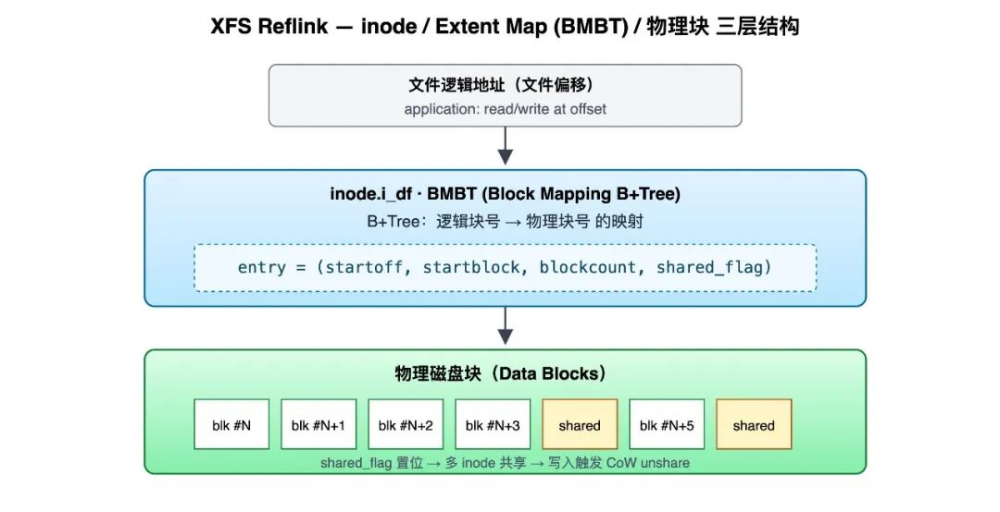

- **BMBT (Block Mapping B-Tree)** is an inode-embedded B+ tree in XFS that stores the mapping table from logical offsets to physical blocks (i.e., the Extent Map).
- Each Extent record has the format: `(logical_offset, physical_block, length, shared_flag)`.
- When `shared_flag` is set, it means the physical block is referenced by multiple file inodes; any write must trigger CoW unshare.

#### ② FICLONE ioctl Execution Path (O(1) Metadata Operation)

FICLONE completes in milliseconds because it **only touches metadata**:

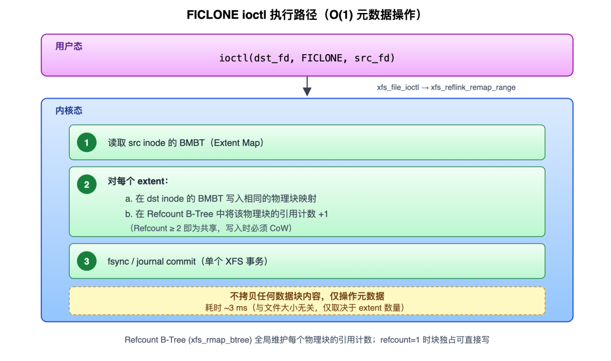

**Refcount B-Tree** (xfs_rmap_btree): XFS maintains a global B-Tree that records the reference count of every physical block. After FICLONE, shared blocks have refcount ≥ 2; when refcount drops to 1, the block returns to exclusive status and can be written directly without CoW.

#### ③ CoW Unshare Path on Write

So what happens when you write to a shared extent? The answer is **split-on-write**:

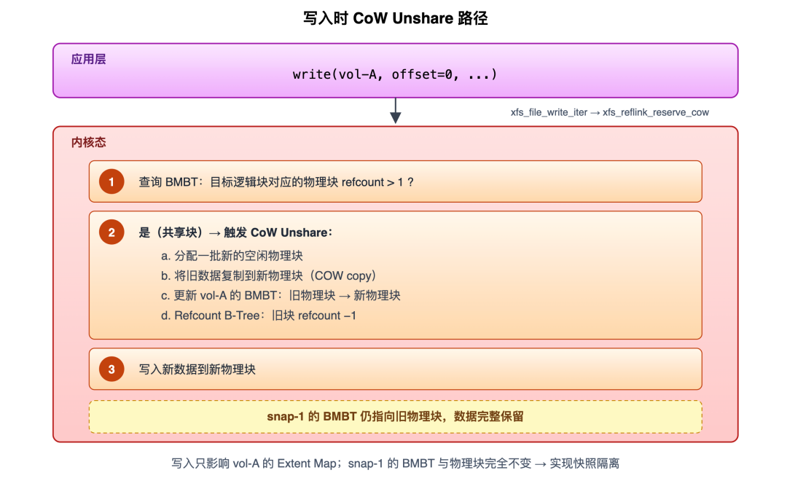

The write only affects the **source volume's** Extent Map; the **snapshot's** BMBT and physical blocks remain entirely unchanged, achieving snapshot isolation.

### 2.3 What CubeCow Builds on Top of Reflink

Bare reflink only solves "how to go fast", not "how to manage state". CubeCow adds three engineering designs at the engine layer:

#### ① Snapshot Chain Flattening (Avoiding Snap-of-Snap Chain Tracking)

Standard reflink supports "snapshots of snapshots", but CubeCow uniformly records the `origin_volume` of every snapshot as the **ultimate ancestor volume**, and physically places all snapshot files under the ancestor volume's directory.

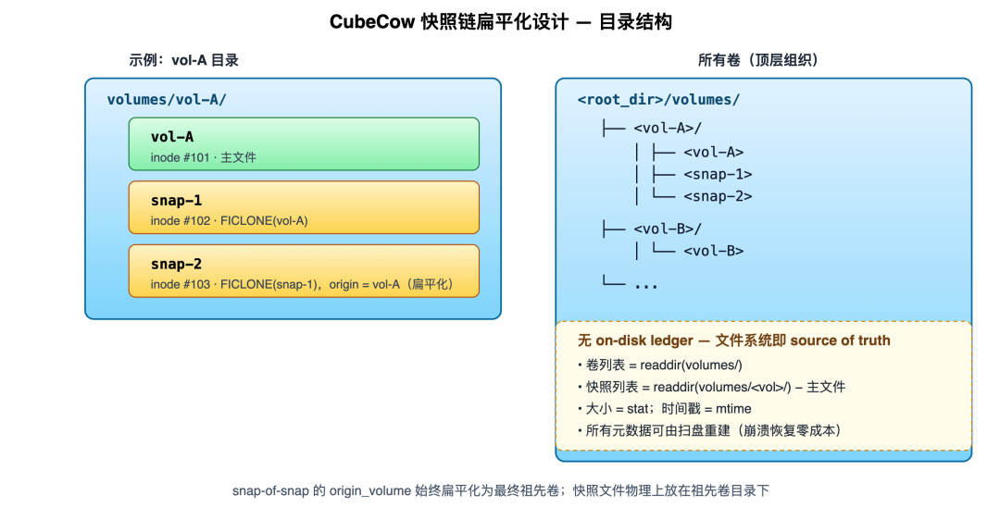

**Benefits of flattening**:

- From the filesystem's perspective, all snapshots are **sibling independent files** alongside the primary volume — each has its own independent block mapping, with no parent-child subordination. The "lineage" is purely a piece of logical information in CubeCow's in-memory index. Deleting any intermediate snapshot degenerates into unlinking an ordinary file: one directory entry is removed, the XFS Refcount B-Tree automatically decrements the refcount of the formerly shared physical blocks, and all other snapshots remain completely unaffected.
- The directory structure maps one-to-one with `origin_volume`, requiring no recursive lookups.
- After the primary volume file is deleted, the directory is preserved because snapshot files still exist within it; when the last snapshot is removed, the directory is automatically reclaimed.

#### ② Filesystem as Source of Truth (No On-Disk Ledger)

**All metadata can be reconstructed from the directory structure**:

- Volume list = `readdir(volumes/)`
- Snapshot list = `readdir(volumes/<vol>/)` minus the primary file
- Size = `stat`, timestamp = `mtime`

At engine startup, `scan_and_rebuild_index()` scans the disk and rebuilds the index, handling crash residuals according to these rules:

| Disk State | Handling |
| --- | --- |
| `<vol>/<vol>` primary file exists | Register as Volume |
| Directory exists but primary file missing and no children | Delete empty directory (orphan) |
| Directory exists but primary file missing and children exist | Warn, recover child snapshots but do not register volume |
| Zero-byte snapshot file | Delete (FICLONE incomplete at crash time) |
| Name collision | Warn and skip |

#### ③ In-Memory Namespace Flattening

The ReflinkEngine maintains a `RwLock<HashMap<String, NameKind>>` as a global namespace; volume names and snapshot names share the same global namespace, with atomic pre-allocation under the write lock to prevent concurrent naming conflicts. This means any new volume or snapshot creation never requires a recursive "check lineage then confirm no duplicate name" process — a single lookup inside the lock suffices.

### 2.4 Summary

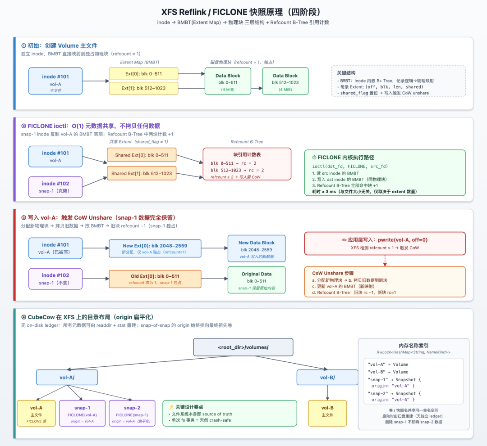

A single snapshot involves only three non-skippable actions at the engine layer: **grab the name → one FICLONE → commit the directory entry**. All three are O(1) operations and none involve data block copies — that is the entire secret of "split-second" snapshots.

## 3. Puzzle 2: How Do Memory Snapshots Write Only a "Fraction" of Pages?

### 3.1 The Phenomenon and Challenge

VM memory routinely reaches tens of GiB. If every snapshot wrote the entire guest RAM to disk, the IO amplification would render "frequent checkpointing" completely unusable. v0.3.0's memory snapshots introduce **two optimization paths** that, combined with disk reflink, minimize the steady-state memory write volume. For performance data, see: [CubeSandbox v0.3.0: A Time Machine and a Cloning Booth for Your AI Agents](https://github.com/TencentCloud/CubeSandbox).

### 3.2 Three Memory Snapshot Modes

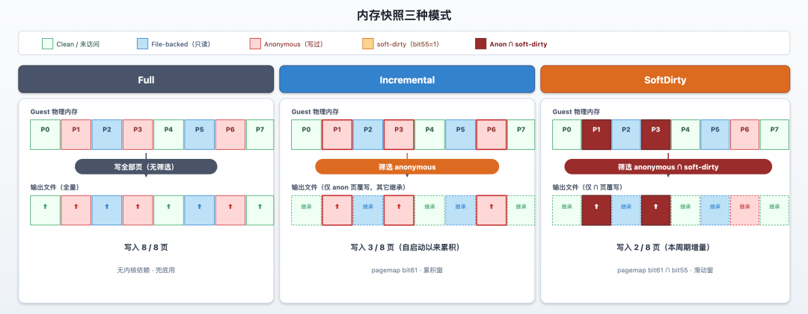

Cube Sandbox defines three memory snapshot modes, corresponding to three strategies for "which pages should I write to the image":

| Mode | What Gets Written | Use Case |
| --- | --- | --- |
| Full | Complete guest memory image, all pages | First snapshot, strong-consistency archival |
| Incremental | Only CoW anonymous pages (pages the guest has truly "allocated with content") | Most steady-state snapshots |
| SoftDirty | True incremental: only anonymous pages written since the last reset | High-frequency checkpointing; kernel requires CONFIG_MEM_SOFT_DIRTY |

### 3.3 Under the Hood: Incremental — How "Anonymous Pages" Exactly Equal "Pages Written Since Boot"

#### Key Premise: v0.3.0 Sandboxes Are "Boot-from-Snapshot"

To grasp the elegance of Incremental, you must first recognize a premise: in Cube Sandbox, **almost every VM is restored from a memory snapshot** — first-time sandbox creation boots from a template memory image; cloned copies boot from a temporary snapshot; rolled-back VMs boot from the target snapshot. The "cold boot to a completely zeroed state" scenario practically does not exist on the production path.

When restoring, the VMM does **not** `read()` the entire memory image into an anonymous mmap — that would be both slow and wasteful. Instead it uses `mmap(MAP_PRIVATE, fd=memory_image)` to map the memory image file directly into the virtual address space corresponding to the guest RAM. This step only establishes the VMA, reading no data at all. As the guest runs and actually accesses a page, the kernel lazily populates that page from the page cache.

#### MAP_PRIVATE's Binary Semantics: File Pages vs. Anonymous Pages

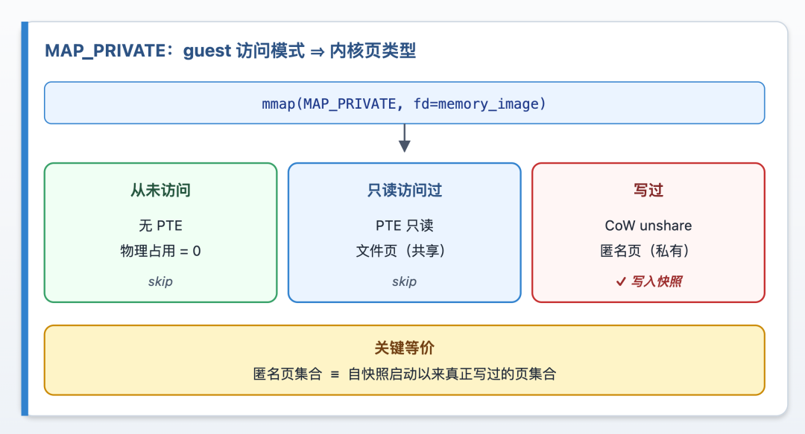

The core semantic of MAP_PRIVATE is **copy-on-write of a file**:

| Guest behavior toward the page | Kernel-side page type | Physical footprint |
| --- | --- | --- |
| Never accessed | No PTE present, demand-fault on access | 0 |
| Read-only access only | File page (shared page cache, PTE read-only pointing to page cache frame) | Shared with other snapshot instances within the same process |
| Written at least once | Anonymous page (process-private page from CoW unshare) | Exclusively owned by this VM process |

Note the second row: pages that the guest has only read **remain file pages** — they physically stay in the memory image file's page cache, shared with other VMs booted from the same image, and do not count toward this process's anonymous page statistics. Only when the guest first writes to a page does the kernel trigger CoW, "splitting" that page from a file page into a process-exclusive anonymous page.

This yields a **free equivalence relation**:

> **This VM process's anonymous page set ≡ the set of pages genuinely written since this VM booted from its snapshot**

This equivalence requires no additional tracking and has zero runtime overhead — it is a natural byproduct of MAP_PRIVATE semantics. The Linux kernel has been maintaining it for us in every write-fault all along.

#### How Incremental Reads This Set

Using the equivalence above, "which pages need to go into the snapshot" reduces to "which pages are anonymous". Linux exposes the status of every virtual page via `/proc/<pid>/pagemap` at 8 bytes per page, with these key bits:

| Bit | Meaning |
| --- | --- |
| bit 63 | Whether this VPN maps a physical page frame (present) |
| bit 62 | Whether swapped out |
| bit 61 | Whether anonymous (i.e., a private page that has been CoW-split) |
| bit 0–54 | Physical frame number PFN (when present) |

Incremental's filter condition is exactly **present ∧ anonymous** — directly corresponding to "pages genuinely written since boot". Each page requires only 8 bytes of metadata for the decision, **without needing to read the page contents**.

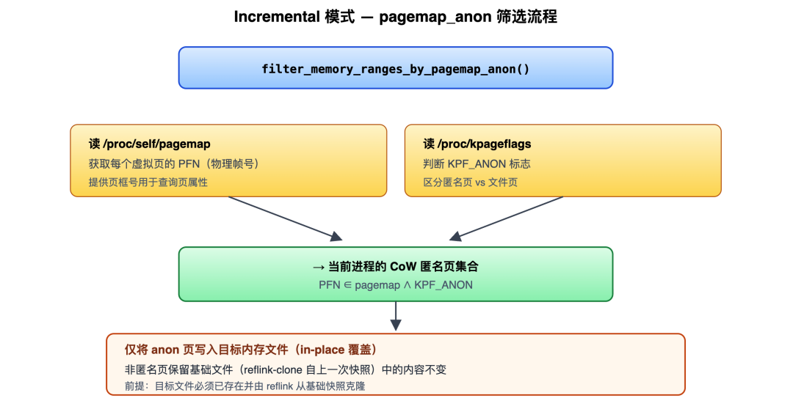

#### How Completeness Is Guaranteed

The snapshot file written by Incremental **preserves the full guest physical address layout** — offsets that were not written **inherit the contents of the previous snapshot**. This requires:

- **The destination file already exists** and its content is a reflink-clone of the previous snapshot — offsets not overwritten by this write automatically equal the corresponding positions in the previous snapshot.
- The file-page portion (pages the guest only read, or never accessed) is byte-for-byte identical to the previous snapshot in the new snapshot file, because they are literally the same memory image content.

This is the "disk subsystem in turn supports the memory subsystem" point from 3.1 — without the "cheap baseline file" provided by reflink-clone, Incremental could not produce a "complete image" by writing only a subset.

#### What Incremental Solves, and What's Still Missing

Incremental achieves a one-shot optimization with zero runtime overhead: **converging "all of guest RAM" down to "pages written since boot"**. For short-lived sandboxes (typical scenarios: one-shot task execution, short-lived clones) this is sufficient.

But for **long-running** sandboxes, this set is monotonically growing — the longer the guest runs, the more pages have been written, and "pages written since boot" gradually approaches "all allocated pages". This is the problem SoftDirty is designed to solve.

### 3.4 Under the Hood: SoftDirty — Capturing "Pages That Were Actually Written" with bit55

#### Motivation: Why Incremental Falls Short

Consider a long-running sandbox (say, a VM running an inference service) that is periodically checkpointed throughout its lifecycle:

| Moment | Cumulative pages written since boot | Incremental snapshot write volume |
| --- | --- | --- |
| t₁ (right after boot) | 200 MiB | 200 MiB |
| t₂ (1 min after t₁) | 1 GiB | 1 GiB |
| t₃ (10 min after t₂) | 5 GiB | 5 GiB |
| t₄ (1 hour after t₃) | 15 GiB | 15 GiB |

Although only tens of MiB may have genuinely changed between two consecutive snapshots, Incremental **re-writes all pages written since boot every time**. The anonymous page set monotonically increases, and the checkpoint data volume grows linearly with uptime, eventually approaching Full mode.

To make "frequent checkpointing" viable for long-running sandboxes, we must be able to identify "pages written only since the last snapshot". That is the gap SoftDirty fills.

#### Kernel Semantics of the soft-dirty Bit

Linux reserves a soft-dirty bit in every PTE (exposed to userspace as bit55 in `/proc/<pid>/pagemap`), with a very simple state machine:

| Trigger Action | Effect |
| --- | --- |
| Process writes to a page | The page's PTE soft-dirty bit is set by the kernel |
| Userspace writes 4 to /proc/\<pid\>/clear_refs | The kernel walks all PTEs of the process, clears all soft-dirty marks, and changes the corresponding PTEs to read-only |
| Another write after reset | Triggers a write-protection fault → kernel restores writable + re-sets soft-dirty |

After a reset, bit55=1 precisely equals "this page has been written since the last reset".

#### The Filter: Adding a Sliding Window Atop Anonymous Pages

SoftDirty mode does not discard Incremental — it **superimposes an additional soft-dirty filter over its output set**:

```
Pages to write to snapshot = { p | present(p) ∧ anonymous(p) ∧ soft_dirty(p) }
                             └─── Incremental set ───┘ └ incremental filter ┘
```

`anonymous` narrows the scope to "pages written since boot" (see 3.3); `soft_dirty` further narrows to "pages written since the last reset". The former is a **cumulative window**, the latter a **sliding window** — their intersection is exactly the pages that "belong to this VM's private memory AND genuinely need to be flushed for this snapshot".

In code, this is just one more bit read and one more bitwise AND in the same pagemap scan — **virtually zero additional cost**. And precisely because this is superposition rather than replacement, SoftDirty can "silently degrade" to Incremental when the kernel lacks support — the only thing lost is the final `∧ soft_dirty` term, with no correctness impact.

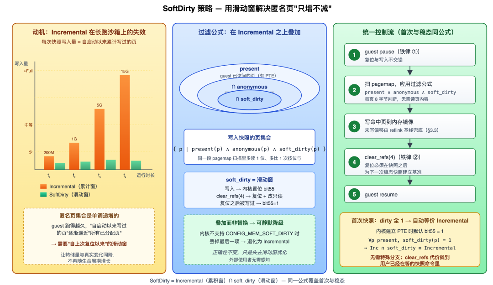

#### First Snapshot: Why It "Automatically" Equals Incremental

The initial state of soft-dirty is key: at the moment the kernel establishes a PTE for a page table entry, it **defaults soft-dirty to 1** — the kernel semantics are essentially "if this page has a PTE but you've never reset it, treat it as dirty".

So when taking the first SoftDirty snapshot, the filter condition **automatically degenerates** to Incremental — it writes all anonymous pages, which is exactly the full baseline this snapshot needs. Only afterward do we call clear_refs to zero out all soft-dirty bits, establishing the baseline for the "next steady-state snapshot".

This is an elegant property: **SoftDirty's first snapshot requires zero special branching**. The filter formula `anonymous ∧ soft_dirty` is correct in both states — on the first snapshot, dirty is all-1s and it degenerates to Incremental; every subsequent snapshot gets the true delta.

#### Two Iron Laws of Consistency

For this mechanism to be correct, two conditions must hold:

- **Reset and write must not interleave**. If guest writes are allowed between "reset → take next snapshot", you'd get a window where "I wrote but the bit was already cleared". v0.3.0's strategy: every time a SoftDirty snapshot is taken, the guest is already paused; the sequence "read pagemap → write snapshot → reset bits → resume" completes while paused.
- **Reset must happen AFTER the snapshot, not BEFORE it**. This snapshot consumes the dirty marks accumulated **since the last reset**; after writing, we reset so the next snapshot has the correct baseline. The first snapshot follows this same iron law — it just consumes the "kernel-given initial all-1s", and the first clear_refs after writing is what truly starts the "delta clock".

#### Side Effect: The Cost of Reset Is Naturally Amortized

clear_refs is not free — the kernel performs a **full page table walk**, rewriting each PTE to read-only and clearing the bit. For a multi-GiB guest, this is a hundreds-of-milliseconds cost, and during the scan, subsequent guest writes will trigger additional write-protection faults.

Thanks to the "first-snapshot-equals-Incremental" property above, v0.3.0 does not need to pay the reset cost upfront at VM boot/restore time for SoftDirty's sake (which would freeze the VM for hundreds of milliseconds the first time it enters userspace after becoming ready). Instead, the first clear_refs is naturally deferred until after the first snapshot's "write" phase — at that point the user is already waiting for the snapshot command to return, and the reset cost is absorbed into an operation where the user already expects to spend time, making it imperceptible.

#### Incremental vs. SoftDirty: Trade-offs

| Dimension | Incremental | SoftDirty |
| --- | --- | --- |
| Kernel requirement | /proc/pagemap (universally available) | Additionally requires CONFIG_MEM_SOFT_DIRTY |
| Filter strength | Allocated anonymous pages | Allocated ∧ actually-written anonymous pages |
| Side effects | None (reads pagemap fresh each time) | Yes (needs PTE reset, affects write-protection fault path) |
| Suitable frequency | Low-to-mid frequency snapshots, first snapshot, degraded fallback | High-frequency checkpointing |
| Behavior on failure | Always available | Automatically degrades to Incremental |

### 3.5 External Memory Volume Support

Memory images can be written to independent storage media (separate volumes or paths) rather than co-located with the state JSON. This is helpful for distributing memory image I/O pressure across different storage pools: the internal mode favors "truncate and rebuild" to guarantee independence between snapshots; the external volume mode favors "open and write in-place", allowing the external volume to be reflink-reused across multiple snapshots.

## 4. Puzzle 3: Why Is Cloning N Copies "Zero-Copy"?

### 4.1 The Phenomenon

Forking N clones from a running source sandbox in one operation adds almost no disk usage, yet each clone can read and write independently. Every clone satisfies three properties:

| Property | Meaning |
| --- | --- |
| Inheritance | Each copy's initial state is identical to the source sandbox at clone time |
| Isolation | Writes between copies are invisible to each other, and isolated from the source sandbox |
| Continuity | The source sandbox continues running after clone() returns, its state unaffected |

### 4.2 Under the Hood: clone(n) Is Not a New Primitive — It's Three Old Primitives Composed

`clone(n)` introduces zero new "clone RPCs" at the protocol layer. Conceptually it is equivalent to:

```python
def clone(self, n=1, *, concurrency=1):
  snap = self.create_snapshot()      # ① One snapshot of the source sandbox
  try:
    new_sbs = [Sandbox.create(template=snap.snapshot_id)
         for _ in range(n)]   # ② n × create from snapshot
  finally:
    Sandbox.delete_snapshot(snap.snapshot_id)  # ③ best-effort cleanup
  return new_sbs
```

### 4.3 Under the Hood: How "Zero-Copy" and "Full Isolation" Coexist

This is the result of the disk subsystem and memory subsystem mechanisms composing:

| Dimension | What Is Shared | How Isolation Is Enforced on Write |
| --- | --- | --- |
| Disk rootfs | Shared XFS extents (refcount ≥ N+1) | XFS reflink CoW unshare |
| Guest memory | Shared reflink-cloned memory-ranges file + physical pages | Process-private anonymous pages + kernel CoW (same semantics as fork) |

So after clone(n=10), disk usage barely grows — 10 rootfses share the same set of XFS physical blocks; memory images also share the same set of extents. When any copy writes, the kernel handles the "split", and they don't interfere.

### 4.4 Under the Hood: Fail-Safe Semantics for Concurrent Clone

```python
clones = src.clone(n=10, concurrency=5)
```

The concurrency parameter C keeps the first-step snapshot and the last-step snapshot deletion as singletons; only the N intermediate create-from-snapshot operations are parallelized.

**All-or-nothing contract**: If any subtask fails, already-successful clones are automatically destroyed and the temporary snapshot is deleted. The caller gets either N sandboxes or an exception — **no orphan resources**.

### 4.5 Under the Hood: Continuity of the Source Sandbox

When deriving the temporary snapshot, the VM internally executes pause → snapshot → resume, and the entire pause duration is typically under 100 milliseconds. After returning, the source sandbox continues running with the same PID and same memory mappings — that is the source of "continuity".

## Final Chapter: Connecting the Three Mechanisms — Cubelet's Three-Tier Degradation Strategy

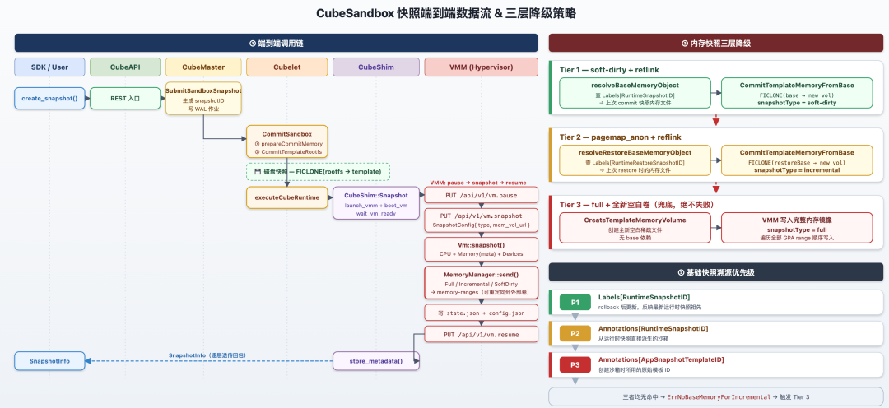

On every snapshot submission, the node-side decides two things: which memory mode to use, and which historical volume to target as the reflink base. Three-tier degradation guarantees availability: the automatic soft-dirty → pagemap_anon → full degradation chain ensures that any anomaly (base snapshot deleted, snapshot chain broken, kernel lacking soft-dirty support) never causes a user-visible failure — instead it silently upgrades to a correct but slightly larger snapshot.

## Afterword

If you are building systems that require code execution, tool calling, or multi-Agent collaboration, we welcome you to explore and try Cube Sandbox.

If you found this helpful, a ⭐ Star is much appreciated — Issues and PRs are also welcome. Every piece of feedback is fuel for the project's continued evolution.

**Cube Sandbox: https://github.com/TencentCloud/CubeSandbox**

---

Cube Sandbox is a high-performance, batteries-included secure sandbox service open-sourced by Tencent Cloud, built on RustVMM and KVM. It supports single-machine deployment and can scale out to multi-machine clusters. It is externally compatible with the E2B SDK and can create fully capable, hardware-isolated sandboxes within 60 ms while keeping the memory overhead under 5 MB.
