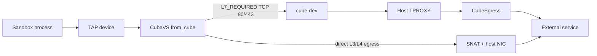
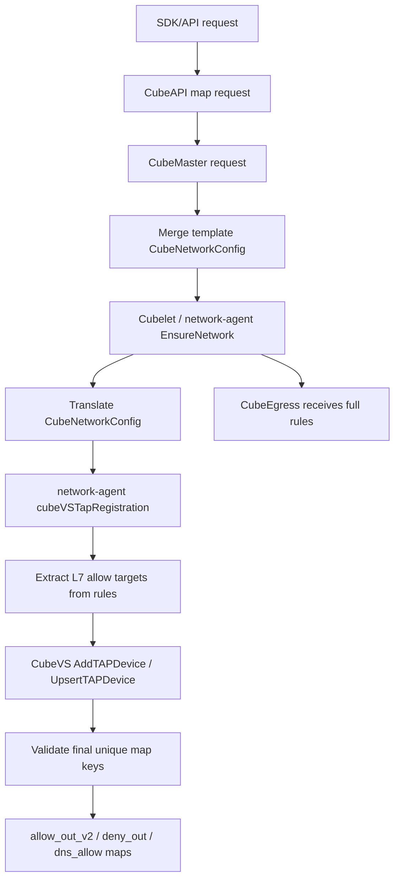
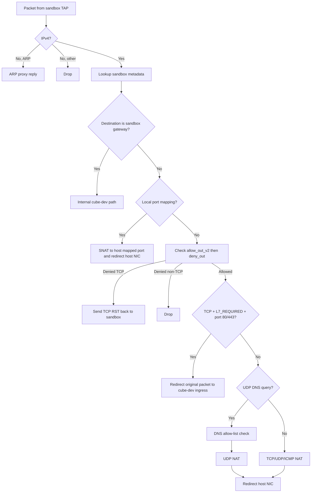

# Egress Network Policy

Cube Sandbox egress control is not a single switch. It is a chain formed by **API validation, template merging, network-agent programming, the CubeVS eBPF data plane, and the CubeEgress L7 proxy**. Once you understand this chain, it becomes much easier to predict whether a packet will be forwarded directly, rejected, ignored by DNS learning, or redirected into the HTTP/HTTPS proxy.

This page explains:

- How users configure egress policy from the SDK / API.
- How `allow_out`, `deny_out`, and `rules` are merged and programmed.
- How CubeVS decides, step by step, in the `from_cube` direction.
- How DNS domain allow-listing and A-record learning work.
- Which traffic reaches CubeEgress and which traffic does not.
- Common configuration examples and troubleshooting steps.

For request-level L7 behavior such as full HTTP/HTTPS rule matching, audit logs, header injection, and TLS CA handling, see [Security Proxy](./security-proxy.md). This page focuses on the network-layer path that makes proxy routing possible.

## Overall architecture

After egress traffic leaves the sandbox, it roughly follows this path:



Each component has a distinct responsibility:

| Component | Responsibility |
| --- | --- |
| CubeAPI | Receives SDK/API requests, maps the network configuration, and forwards a CubeMaster request. |
| CubeMaster | Merges template network configuration with the current create request and schedules the sandbox through Cubelet/network-agent. |
| network-agent | Converts `CubeNetworkConfig` into CubeVS `MVMOptions`, extracts network reachability targets from L7 `rules`, and registers or updates the TAP eBPF maps. |
| CubeVS | Runs in the host eBPF data plane. It enforces per-sandbox L3/L4 allow/deny policy, DNS A-record learning for configured domains, session/NAT, TCP RST rejection, and L7 proxy routing decisions. |
| CubeEgress | Transparent HTTP/HTTPS proxy. It only receives TCP/80 and TCP/443 traffic that CubeVS marked as requiring L7 checks, then evaluates the complete `rules` list. |

A key point: **active outbound policy decisions happen in the `from_cube` direction**, after sandbox traffic enters the TAP device. The host-NIC `from_world` direction mainly handles reverse NAT for existing sessions, port-mapped inbound traffic, and DNS response learning. It is not the primary allow/deny decision point for outbound policy.

## User-facing configuration fields

At sandbox creation time, these fields jointly control egress behavior:

| Field | Where to set it | Layer | Meaning |
| --- | --- | --- | --- |
| `allow_internet_access` | `Sandbox.create(allow_internet_access=...)` | CubeVS | Whether public internet egress is allowed by default. Defaults to `true`. When set to `false`, CubeVS installs a `0.0.0.0/0` deny-all rule and relies on explicit allow targets to punch holes. |
| `allow_out` | `network["allow_out"]` | CubeVS | Explicitly allowed IPv4 addresses, CIDRs, or DNS names. IP/CIDR targets go into `allow_out_v2`; domain targets go into `dns_allow` and become temporary IP allows through DNS query/response learning. |
| `deny_out` | `network["deny_out"]` | CubeVS | Explicitly denied IPv4 addresses or CIDRs. Domain names are not accepted here. |
| `rules` | `network["rules"]` | CubeVS + CubeEgress | HTTP/HTTPS L7 rules. CubeVS only extracts `match.sni` / `match.host` as network reachability targets and attaches the L7 flag; CubeEgress evaluates the complete match/action rule. |

CubeVS evaluates the base IP policy in this order:

1. **Check `allow_out_v2` first**: if it matches, the packet is allowed. If the matched entry carries the `L7_REQUIRED` flag, TCP/80 and TCP/443 are later redirected to CubeEgress.
2. **Check `deny_out` next**: if it matches, the packet is rejected. TCP is reset when possible; non-TCP is dropped.
3. **Default allow if neither matches**: unless `allow_internet_access=false` installed `0.0.0.0/0` in `deny_out`.

In short, policy priority is: **allow > deny > default allow**.

::: warning Built-in protection for internal CIDRs
When `allow_internet_access` is not `false`, CubeVS adds sandbox-private and host-internal CIDRs to `deny_out` by default: `10.0.0.0/8`, `127.0.0.0/8`, `169.254.0.0/16`, `172.16.0.0/12`, and `192.168.0.0/16`. This prevents workloads from using public egress policy to reach Cube infrastructure.

When `allow_internet_access=false`, the backend installs `0.0.0.0/0` as deny-all; explicit `allow_out` and L7 targets can still take precedence.
:::

## Entry limits

Before changing a sandbox's eBPF maps, CubeVS counts the final unique map keys produced from `allow_out`, `deny_out`, and the network targets extracted from `rules`. Limit errors propagate back through network-agent, Cubelet, CubeMaster, and CubeAPI to the sandbox create caller.

| Final map counter | Limit |
| --- | --- |
| `network.allow_out_v2`: unique IP/CIDR allow keys from `allow_out` plus `rules[].match.host/sni` | `8192` entries |
| `network.deny_out`: unique effective deny keys, including built-in internal CIDRs when enabled | `8192` entries |
| `network.dns_allow`: unique domain keys from `allow_out` plus `rules[].match.host/sni` | `1024` entries |

The DNS inner trie has `1024` domain-rule entries. DNS policy mode is stored separately in `ifindex_to_mvmmeta`, so `dns_allow` no longer reserves an entry for a mode marker.

Equivalent targets are deduplicated by their final map key. For example, `198.51.100.1` and `198.51.100.1/32` are one IP key, while domain keys are lowercased and ignore a trailing dot.

Over-limit errors identify the final map counter, actual count, and maximum:

```text
network.allow_out_v2 exceeds maximum entries: got 8193, max 8192
network.deny_out exceeds maximum entries: got 8193, max 8192
network.dns_allow exceeds maximum entries: got 1025, max 1024
```

## Configuration syntax

### `allow_out`

Use `allow_out` for L3/L4 reachability. It accepts:

- IPv4 addresses, such as `1.1.1.1`, internally treated as `/32`.
- IPv4 CIDRs, such as `203.0.113.0/24`.
- DNS names, such as `api.example.com`.
- Leading `*.` wildcard DNS names, such as `*.example.com`.

Wildcard domains match subdomains only, not the apex domain:

| Config | Matches | Does not match |
| --- | --- | --- |
| `*.example.com` | `api.example.com`, `a.b.example.com` | `example.com` |
| `example.com` | `example.com` | `api.example.com` |

Domains are lowercased and trailing dots are removed. Only valid DNS names are accepted. Dotted-decimal strings that are not valid IPv4 addresses, such as `999.999.999.999`, are rejected or ignored depending on where they appear.

When `allow_out` contains a DNS name, the request must also establish a deny-all fallback. Do one of the following:

- Set `allow_internet_access=false`; CubeVS will install `0.0.0.0/0` in `deny_out` automatically.
- Or explicitly include `0.0.0.0/0` in `deny_out`.

This is required because domain `allow_out` entries are learned into temporary IP allow entries after DNS A responses. Without a deny-all fallback, unmatched destinations would still be allowed by the default-allow policy, making the domain allow list misleading.

### `deny_out`

`deny_out` only accepts IPv4 addresses or IPv4 CIDRs:

```python
network={
    "deny_out": [
        "169.254.169.254/32",
        "10.0.0.0/8",
    ],
}
```

`deny_out` does not accept domain names. Domain-based denial would require accounting for DNS resolution, multiple A records, TTLs, CNAMEs, and cache poisoning. The current denial path is a pure IP/CIDR LPM match.

In strict mode with `allow_internet_access=false`, `0.0.0.0/0` is already installed as the fallback deny entry in `deny_out`. Additional narrower `deny_out` entries are usually only documentation of intent and do not make the policy stricter than deny-all; the important configuration is the set of `allow_out` holes or L7 `rules` with `host` / `sni` targets.

### `rules`

`rules` are L7 HTTP/HTTPS rules evaluated by CubeEgress. A rule usually contains:

- `name`: human-readable rule name, used for audit and template merging.
- `match.scheme`: `http` or `https`.
- `match.sni`: TLS SNI. Supports exact domains and leading `*.` wildcard domains.
- `match.host`: HTTP Host. Supports domains, `host:port`, IPv4, IPv4 CIDR, and leading `*.` wildcard domains.
- `match.method`: list of HTTP methods; methods are ORed.
- `match.path`: exact by default; one trailing `*` means prefix match, such as `/v1/*`.
- `action.allow`: `true` allows, `false` rejects.
- `action.audit`: audit level, such as `metadata`, `full`, or `none`.
- `action.inject`: optional header injection, honored only for allowed HTTPS requests when downstream conditions match.

Different match fields are ANDed together. For example, `scheme=https`, `sni=api.example.com`, `method=["POST"]`, and `path=/v1/*` means all those conditions must match.

::: tip Include `host` or `sni` in restricted L7 rules
CubeVS only extracts network reachability from `rules[].match.sni` and `rules[].match.host`. `method`, `path`, and `scheme` are evaluated inside CubeEgress, but they do not tell CubeVS which destination IPs should be allowed or proxy-routed.

Therefore, when `allow_internet_access=false`, each L7 rule that should actually reach an external HTTP/HTTPS service should include `host` or `sni`. A rule with only `method` and `path` may never reach CubeEgress, because the network layer has no destination target to allow.
:::

## Control-plane merge and programming flow

From a user request to eBPF maps, the flow looks like this:



### 1. CubeAPI mapping and forwarding

CubeAPI receives `SandboxNetworkConfig`. Configure network policy as follows:

```python
network={
    "allow_out": ["api.example.com"],
    "deny_out": ["203.0.113.0/24"],
    "rules": [...],
}
```

CubeAPI maps the request into CubeMaster's `CubeNetworkConfig` and forwards `allow_out`, `deny_out`, and the complete `rules` list.

### 2. CubeMaster template merging

If the template also carries a `CubeNetworkConfig`, CubeMaster merges template configuration with the current request:

- `allowInternetAccess`: request value overrides the template value when explicitly set.
- `allowOut`: request entries are appended to template entries and deduplicated by string.
- `denyOut`: request entries are appended to template entries and deduplicated by string.
- `rules`: merged by `name`. A request rule with the same name overrides the template rule; rules with new names are appended after template rules, preserving first-match-wins order.

The merged `CubeNetworkConfig` is sent to Cubelet/network-agent. CubeVS validates the final unique eBPF map keys after network-agent extracts L7 reachability targets.

### 3. network-agent extracts CubeVS targets

network-agent receives `CubeNetworkConfig` and constructs CubeVS `MVMOptions`:

- `AllowInternetAccess`: defaults to `true` when omitted.
- `AllowOut`: copied from merged `allowOut`.
- `DenyOut`: copied from merged `denyOut`.
- `L7AllowOut`: extracted from every `rules[].match.sni` and `rules[].match.host`.

L7 target extraction works as follows:

| Source | Handling |
| --- | --- |
| `match.sni` | Accepts only valid domains or leading `*.` wildcard domains; lowercases and removes a trailing dot; IPs are not accepted. |
| `match.host` as `host:port` | Strips the port and keeps the host. |
| `match.host` as IPv4 | Keeps it as an IP `/32` target. |
| `match.host` as IPv4 CIDR | Keeps the CIDR. |
| `match.host` as domain or `*.` wildcard domain | Normalizes it into a lowercase domain target. |
| Invalid host/SNI | Not programmed as a CubeVS target. |

For example:

```python
rules = [
    Rule(match=Match(sni="API.Example.COM."), action=Action(allow=True)),
    Rule(match=Match(host="gateway.example.com:8443"), action=Action(allow=True)),
    Rule(match=Match(host="1.2.3.4:443"), action=Action(allow=True)),
    Rule(match=Match(host="10.1.2.3/8"), action=Action(allow=True)),
]
```

extracts targets similar to:

```text
api.example.com
gateway.example.com
1.2.3.4
10.0.0.0/8
```

The difference from plain `allow_out` is that these targets carry the `L7_REQUIRED` flag.

### 4. CubeVS map programming

network-agent finally programs different sources into different maps:

| Source | Map | `L7_REQUIRED`? | Purpose |
| --- | --- | --- | --- |
| `allow_out` IPv4/CIDR | `allow_out_v2[ifindex]` | No | Allow direct L3/L4 egress. |
| `allow_out` domain | `dns_allow[ifindex]` | No | Track matching DNS A queries and learn response A records into `allow_out_v2`. Requires `allow_internet_access=false` or explicit `deny_out=["0.0.0.0/0"]` so non-learned IPs are not default-allowed. |
| `rules[].match.host/sni` IPv4/CIDR | `allow_out_v2[ifindex]` | Yes | Allow the IP/CIDR and route TCP/80 and TCP/443 to CubeEgress. |
| `rules[].match.host/sni` domain | `dns_allow[ifindex]` | Yes | Track matching DNS A queries and learn IPs with the L7 flag without changing unrelated DNS names. |
| `deny_out` | `deny_out[ifindex]` | N/A | Reject matching destination IP/CIDR unless allow matched first. |
| Built-in internal CIDRs | `deny_out[ifindex]` | N/A | Prevent access to Cube internal infrastructure. |
| `allow_internet_access=false` | `deny_out[ifindex]` | N/A | Install `0.0.0.0/0` deny-all. |

If the same IP/CIDR appears in both plain `allow_out` and an L7 rule target, CubeVS preserves the `L7_REQUIRED` flag. Static `allow_out` entries do not expire; DNS-learned entries have `expires_at_ns` and expire according to DNS TTL.

## How `from_cube` decides and forwards

`from_cube` is the TC eBPF program attached to sandbox TAP ingress. Every packet sent by the sandbox enters this program first. You can think of it in these stages:



### 1. Non-IPv4 and ARP

CubeVS mainly handles IPv4 egress. ARP requests are answered directly by eBPF so the sandbox can resolve its gateway. Other non-IPv4 packets are dropped.

### 2. Sandbox gateway / cube-dev traffic

If the destination is the sandbox gateway `169.254.68.5`, this is the internal `cube-dev` path and is not treated as normal public egress. The current logic allows only:

- ICMP.
- TCP non-SYN packets.

TCP SYN and other protocols are dropped. Allowed internal packets are DNATed to `cubegw0_ip` and redirected to `cube-dev`.

### 3. Local port-mapping optimization

For TCP traffic, `from_cube` checks `local_port_mapping`. If the sandbox source port corresponds to a host port mapping, CubeVS performs port SNAT and redirects the packet to the host NIC. This is an optimization for port-mapping scenarios.

### 4. Egress network policy

Normal external traffic enters `check_net_policy`:

1. Look up the destination IP in `allow_out_v2[ifindex]` with LPM.
   - If matched and not expired: allow.
   - If the value contains `NET_POLICY_FLAG_L7_REQUIRED`, TCP/80 and TCP/443 are later routed to the proxy.
2. If allow did not match, look up the destination IP in `deny_out[ifindex]` with LPM.
   - If matched: reject.
3. If neither allow nor deny matched: default allow.

For rejected packets:

- TCP: CubeVS tries to synthesize a TCP RST back to the sandbox, so user space usually sees `Connection refused` or an immediate connection failure instead of a long timeout.
- UDP/ICMP: the packet is dropped.

::: tip TCP non-SYN packets without a session
For outbound TCP NAT, only a first packet with `SYN && !ACK && !FIN && !RST` can create a new session. Later TCP packets must find an existing entry in `egress_sessions`. If the sandbox sends a non-SYN TCP packet without a session, CubeVS returns a TCP RST instead of creating a new connection.

This logic happens in the `from_cube` direction. The `from_world` direction only reverse-NATs replies that match `ingress_sessions`; packets without a match are generally passed back to the kernel instead of being evaluated as outbound policy rejects.
:::

### 5. L7 proxy path

CubeVS does not use the normal SNAT path when a TCP packet satisfies all of these conditions:

- It matched `allow_out_v2`.
- The matched value carries `L7_REQUIRED`.
- The destination port is TCP `80` or `443`.

Instead, CubeVS redirects the original packet to `cube-dev` ingress. Host TPROXY rules then match `iif cube-dev + dport 80/443` and hand the connection to CubeEgress. CubeEgress evaluates the full `rules` grammar: `scheme`, `sni`, `host`, `method`, `path`, `action`, `audit`, and `inject`.

### 6. Normal NAT/session path

TCP/UDP/ICMP traffic that does not require L7 proxying goes through CubeVS NAT/session tracking:

- TCP: only SYN creates a session; later packets update the TCP conntrack state.
- UDP: the first outbound packet creates an `UNREPLIED` session; the first reply moves it to `REPLIED`.
- ICMP: only Echo Request is handled; the identifier is used as the session-key port equivalent.

SNAT rewrites the sandbox source address `169.254.68.6` to a routable host SNAT IP, allocates a dynamic source port, and redirects the packet to the host NIC.

## DNS domain allow-listing and learning

Domain policy is the easiest part to misunderstand. CubeVS does not directly "allow a domain", because real packets only carry destination IPs. Instead, it **tracks configured DNS A queries and learns matching A-record answers into temporary IP allow entries**. DNS names that are not configured are not blocked at DNS time; they simply do not create learned IP allow entries.

### DNS allow map layout

Each sandbox has a `dns_allow[ifindex]` inner map. It is an LPM trie keyed by reversed domain names:

| Config | Reversed-key idea | Match semantics |
| --- | --- | --- |
| `example.com` | `moc.elpmaxe\0` | Exact match for `example.com`. |
| `*.example.com` | `moc.elpmaxe.` | Matches subdomains such as `api.example.com`, not `example.com`. |

`dns_allow` stores only domain rules and rule-specific flags such as `L7_REQUIRED`. The sandbox-level DNS policy mode is stored in `ifindex_to_mvmmeta[].dns_policy_flags`:

| Mode | Domain sources | Query behavior | Learning behavior |
| --- | --- | --- | --- |
| Off | No `allow_out` domains and no L7 rule domains | DNS follows normal UDP egress. | No DNS response learning. |
| Track | At least one `allow_out` domain or L7 rule domain | All DNS names are allowed; matching configured domains are tracked. | Matching A-record responses are learned into `allow_out_v2`; L7 flags are preserved. |

Both `allow_out` domains and L7 rule domains enable DNS learning. Neither source turns DNS itself into an allow-list, and CubeVS no longer returns synthetic NXDOMAIN for unmatched domains.

### DNS query path

When the sandbox sends a UDP/53 query, `from_cube` tries to parse the DNS payload:

1. Only well-formed standard IN A queries are handled.
2. CubeVS parses the QNAME, lowercases it, and reverses it into an LPM-trie key.
3. If the mode is Off, the query follows normal UDP NAT.
4. CubeVS matches the reversed QNAME against the domain rules.
5. If the domain does not match, the query follows normal UDP NAT without creating a pending learning entry.
6. If the domain matches, CubeVS inserts a pending query into `dns_query_track`. The key includes:
   - sandbox ifindex
   - DNS server IP
   - UDP source port
   - DNS ID
   - QNAME hash
7. The pending query lifetime is `10` seconds.
8. The query then continues through UDP NAT to the real DNS server.

As a result, DNS resolution for unrelated domains still succeeds if normal UDP egress is available. In strict domain allow-list configurations, the failure point for unrelated destinations is the later IP connection: because no DNS-learned allow entry is created, the destination IP is rejected by the deny-all fallback.

### DNS response path

DNS responses from the external network enter the host-NIC `from_world` program:

1. `from_world` finds the matching UDP session through `ingress_sessions`.
2. If this is a response from DNS server port `53`, it invokes DNS response learning before reverse NAT.
3. Learning runs only when `ifindex_to_mvmmeta[].dns_policy_flags` has the learning flag and requires the response to match an existing pending query in `dns_query_track`.
4. Only IPv4 A records are learned; AAAA / IPv6 answers are not inserted into `allow_out_v2`.
5. At most the first `8` answers in the response are processed.
6. Learned IPs are inserted as `/32` entries into `allow_out_v2[ifindex]`, with `expires_at_ns` derived from the DNS TTL.
7. If the original DNS allow rule had `L7_REQUIRED`, the learned IP inherits that flag.
8. The pending query is deleted after learning succeeds or fails.
9. The response packet continues through reverse NAT back to the sandbox.

If an IP is already a static `allow_out` entry, DNS learning does not turn it into an expiring temporary entry. The static entry remains non-expiring and flags are merged.

### DNS reaping

The network-agent / CubeVS user-space side periodically scans:

- `allow_out_v2`: removes expired DNS-learned temporary entries.
- `dns_query_track`: removes pending queries that did not receive a response within `10` seconds.

Therefore, if a domain has a short DNS TTL, the corresponding IP allow entry also expires quickly; a later access must trigger another DNS query and learning cycle.

::: warning IPv4 A records are the learned target today
The dynamic domain authorization path learns IPv4 A-record answers only. IPv6 / AAAA answers are not inserted into `allow_out_v2`, and `deny_out` remains an IPv4/IP-CIDR policy.
:::

## Which traffic reaches CubeEgress

CubeEgress does not see every egress packet. Traffic reaches CubeEgress only when the network target came from an L7 rule and the destination port is an HTTP/HTTPS transparent proxy port.

| Traffic | Goes to CubeEgress? | Reason |
| --- | --- | --- |
| TCP destination port `80`, destination IP matches `allow_out_v2` with `L7_REQUIRED` | Yes | HTTP must be evaluated by CubeEgress. |
| TCP destination port `443`, destination IP matches `allow_out_v2` with `L7_REQUIRED` | Yes | HTTPS must be evaluated by CubeEgress using SNI/Host and other rule fields. |
| TCP `80/443`, but destination IP came only from plain `allow_out` without L7 flag | No | It is L3/L4 allowed and NATed directly. |
| TCP ports other than `80/443`, even if the IP came from an L7 target | No | CubeEgress is an HTTP/HTTPS transparent proxy and only intercepts 80/443. |
| UDP/53 DNS queries | No | Handled by CubeVS DNS learning. |
| UDP, ICMP, other TCP ports | No | Handled by CubeVS NAT/session tracking. |
| Traffic matching `deny_out` without a prior allow match | No | Rejected by CubeVS. |
| `from_world` reply traffic | No | Reply direction uses session reverse NAT, not the L7 proxy entry decision. |

Example:

```python
rules = [
    Rule(
        name="allow_api",
        match=Match(scheme="https", sni="api.example.com", host="api.example.com"),
        action=Action(allow=True),
    )
]
```

This rule inserts `api.example.com` into `dns_allow` with `L7_REQUIRED`. The access flow is:

1. The sandbox queries A records for `api.example.com`.
2. CubeVS allows the DNS query and records a pending query.
3. The DNS response returns; CubeVS learns an A record, for example `203.0.113.10/32`, with `L7_REQUIRED`.
4. The sandbox connects to `203.0.113.10:443`.
5. `from_cube` matches the L7-marked `allow_out_v2` entry and redirects the packet to `cube-dev`.
6. TPROXY hands the connection to CubeEgress.
7. CubeEgress evaluates the full rule and decides allow/deny/audit/inject.

## Common configuration examples

### Example 1: Completely disable public egress

Use this for offline code execution or data processing workloads:

```python
from cubesandbox import Sandbox

with Sandbox.create(
    template="tpl_xxx",
    allow_internet_access=False,
) as sb:
    result = sb.commands.run("curl -m 2 https://example.com")
    print(result.stderr)
```

Effect:

- CubeVS installs `0.0.0.0/0` deny-all.
- Without explicit `allow_out` or L7 targets, normal external access is rejected.
- TCP usually receives a fast RST; UDP/ICMP is usually dropped.

### Example 2: Allow only fixed IP/CIDR targets

Use this when only fixed egress services, internal services, or specific DNS servers should be reachable:

```python
from cubesandbox import Sandbox

with Sandbox.create(
    template="tpl_xxx",
    allow_internet_access=False,
    network={
        "allow_out": [
            "1.1.1.1/32",
            "203.0.113.0/24",
        ],
    },
) as sb:
    sb.commands.run("curl http://1.1.1.1")
```

Effect:

- `1.1.1.1/32` and `203.0.113.0/24` are inserted into `allow_out_v2`.
- `0.0.0.0/0` remains in `deny_out` as the fallback deny.
- Allow takes precedence over deny, so these targets remain reachable.

### Example 3: Allow public egress but block sensitive ranges

Use this when general internet access is needed but metadata endpoints or sensitive internal ranges must be blocked:

```python
from cubesandbox import Sandbox

with Sandbox.create(
    template="tpl_xxx",
    allow_internet_access=True,
    network={
        "deny_out": [
            "169.254.169.254/32",
            "10.0.0.0/8",
        ],
    },
) as sb:
    sb.commands.run("curl https://example.com")
```

Effect:

- Public destinations that do not match deny are allowed by default.
- Targets matching `deny_out` are rejected.
- If a target also matches `allow_out`, allow still takes precedence.

### Example 4: Allow only selected domains

Use this when only a few domains should be reachable and HTTP request-level inspection is not needed:

```python
from cubesandbox import Sandbox

with Sandbox.create(
    template="tpl_xxx",
    allow_internet_access=False,
    network={
        "allow_out": [
            "api.github.com",
            "*.example.com",
        ],
    },
) as sb:
    sb.commands.run("curl https://api.github.com")
```

Effect:

- `api.github.com` and `*.example.com` are inserted into `dns_allow`.
- Matching DNS A queries are allowed.
- A records from matching DNS responses are temporarily inserted into `allow_out_v2`.
- Later TCP/443 connections to those IPs are NATed directly and do not enter CubeEgress, because plain `allow_out` does not carry the L7 flag.

If an application bypasses DNS and directly connects to an IP that has not been learned through the sandbox DNS path, it will be rejected by deny-all in a strict allow-list configuration.

### Example 5: Use L7 rules to restrict HTTP method and path

Use this when only a specific API path should be callable:

```python
from cubesandbox import Sandbox, Rule, Match, Action

rules = [
    Rule(
        name="allow_deepseek_chat",
        match=Match(
            scheme="https",
            sni="api.deepseek.com",
            host="api.deepseek.com",
            method=["POST"],
            path="/v1/*",
        ),
        action=Action(allow=True, audit="metadata"),
    ),
]

with Sandbox.create(
    template="tpl_xxx",
    allow_internet_access=False,
    network={"rules": rules},
) as sb:
    sb.commands.run("curl -s https://api.deepseek.com/v1/chat/completions")
```

Effect:

- `api.deepseek.com` is extracted from `sni` / `host` as an L7 allow target.
- DNS-learned A-record IPs carry `L7_REQUIRED`.
- TCP/443 enters CubeEgress.
- CubeEgress evaluates `scheme`, `sni`, `host`, `method`, and `path` completely.

### Example 6: L7 deny returns request-level 403

If you want a clear request-level denial instead of a network drop, use a deny rule:

```python
from cubesandbox import Sandbox, Rule, Match, Action

rules = [
    Rule(
        name="deny_example_subdomains",
        match=Match(scheme="https", sni="*.example.net"),
        action=Action(allow=False, audit="metadata"),
    ),
]

with Sandbox.create(
    template="tpl_xxx",
    allow_internet_access=False,
    network={"rules": rules},
) as sb:
    sb.commands.run("curl -i https://api.example.net")
```

Effect:

- Even though `action.allow=False`, `*.example.net` is still programmed as an L7 target in CubeVS.
- TCP/443 can enter CubeEgress.
- CubeEgress matches the deny rule, returns request-level 403, and records audit information.

Without routing the target into CubeEgress, the lower network layer can only drop or reset the connection; it cannot generate an HTTP 403.

### Example 7: Mix L3 allow and L7 rules

```python
from cubesandbox import Sandbox, Rule, Match, Action

rules = [
    Rule(
        name="allow_payment_api",
        match=Match(
            scheme="https",
            sni="pay.example.com",
            host="pay.example.com",
            method=["POST"],
            path="/api/payments/*",
        ),
        action=Action(allow=True, audit="full"),
    ),
]

with Sandbox.create(
    template="tpl_xxx",
    allow_internet_access=False,
    network={
        "allow_out": [
            "1.1.1.1/32",        # e.g. DNS resolver or fixed service
            "downloads.example.com",
        ],
        "deny_out": ["203.0.113.0/24"],
        "rules": rules,
    },
) as sb:
    sb.commands.run("curl https://pay.example.com/api/payments/create")
```

Effect:

- `1.1.1.1/32` is statically allowed and does not enter CubeEgress.
- `downloads.example.com` is allowed through DNS learning and does not enter CubeEgress.
- `pay.example.com` is learned through DNS with `L7_REQUIRED`, so TCP/443 enters CubeEgress.
- `203.0.113.0/24` is rejected unless a more specific destination was allowed first.

## Behavior cheat sheet

| Config | Target | Result |
| --- | --- | --- |
| `allow_internet_access=True`, no `allow_out`/`deny_out`/`rules` | Normal public IP | Allowed by default, NATed directly. |
| `allow_internet_access=False`, no allow targets | Any public IP | Rejected by `0.0.0.0/0`. TCP RST, non-TCP drop. |
| `allow_internet_access=False` + `allow_out=["1.1.1.1"]` | `1.1.1.1` | Allowed, NATed directly. |
| `allow_internet_access=False` + `allow_out=["api.example.com"]` | DNS first, then learned IP | Allowed after DNS A response is learned, NATed directly. |
| `allow_internet_access=False` + `rules` contains `sni="api.example.com"` | `api.example.com:443` | DNS-learned IP carries L7 flag; TCP/443 enters CubeEgress. |
| `rules` only has `path="/v1/*"`, no `host`/`sni` | Strict allow-list | May never reach CubeEgress because CubeVS has no network target to allow. |
| `deny_out=["203.0.113.0/24"]` | `203.0.113.10` | Rejected unless allow matched first. |
| `allow_out=["203.0.113.10"]` + `deny_out=["203.0.113.0/24"]` | `203.0.113.10` | Allowed because allow has priority. |
| `allow_out=["*.example.com"]` | `example.com` | Does not match. |
| `allow_out=["*.example.com"]` | `api.example.com` | Matches. |

## Observability and troubleshooting

### Inspect CubeVS maps

`cubevsmapdump` is the host-side tool for inspecting CubeVS business maps. It is installed into the normal command path by the release/install package, so use it directly on a deployed node:

```bash
sudo cubevsmapdump --list-maps
sudo cubevsmapdump --map dns_allow,dns_query_track,allow_out_v2,deny_out
sudo cubevsmapdump --ifindex tapxxx --map dns_allow,allow_out_v2,deny_out
```

Useful fields:

| Field | Meaning |
| --- | --- |
| `ifindex_to_mvmmeta[].dns_policy_flags` | Raw sandbox-level DNS policy mode flags. |
| `ifindex_to_mvmmeta[].dns_learning_enabled` | Whether DNS response learning is enabled for this sandbox. |
| `dns_allow[].rules[].domain` | Domain policy rule installed for the sandbox. |
| `dns_allow[].rules[].l7_required` | Whether IPs learned from this domain should later enter CubeEgress. |
| `dns_allow[].enabled` / `learning_enabled` / `flags` | Compatibility view derived from `ifindex_to_mvmmeta`, not entries stored in `dns_allow`. |
| `dns_query_track` | DNS queries currently waiting for responses; usually short-lived. |
| `allow_out_v2[].entries[].expires_at_ns` / `expires_in` | `0` or empty means static allow; non-zero means DNS-learned temporary entry. |
| `allow_out_v2[].entries[].l7_required` | Whether TCP/80 and TCP/443 flows to this IP should enter CubeEgress. |
| `deny_out` | Current deny CIDRs for the sandbox, including user entries, built-in internal CIDRs, or deny-all. |

### Check services

```bash
sudo systemctl status cube-sandbox-network-agent.service
sudo systemctl status cube-sandbox-cube-egress.service
sudo systemctl restart cube-sandbox-compute.target
```
