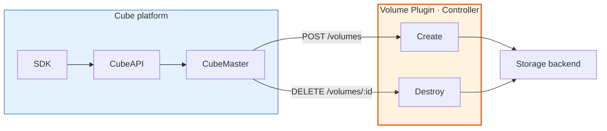
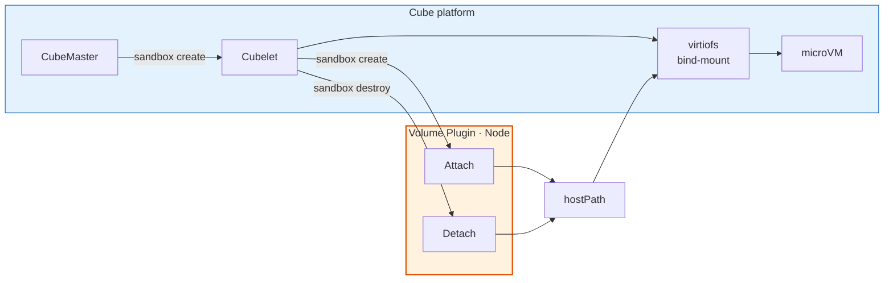
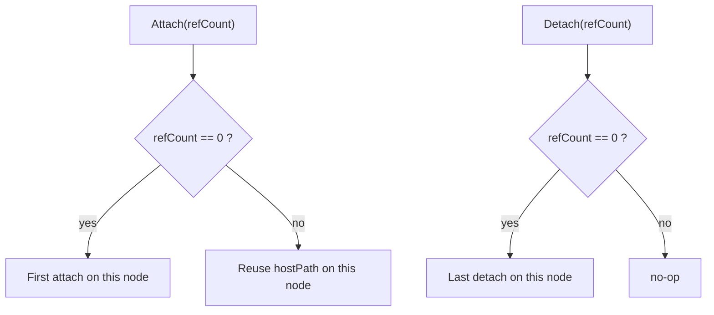
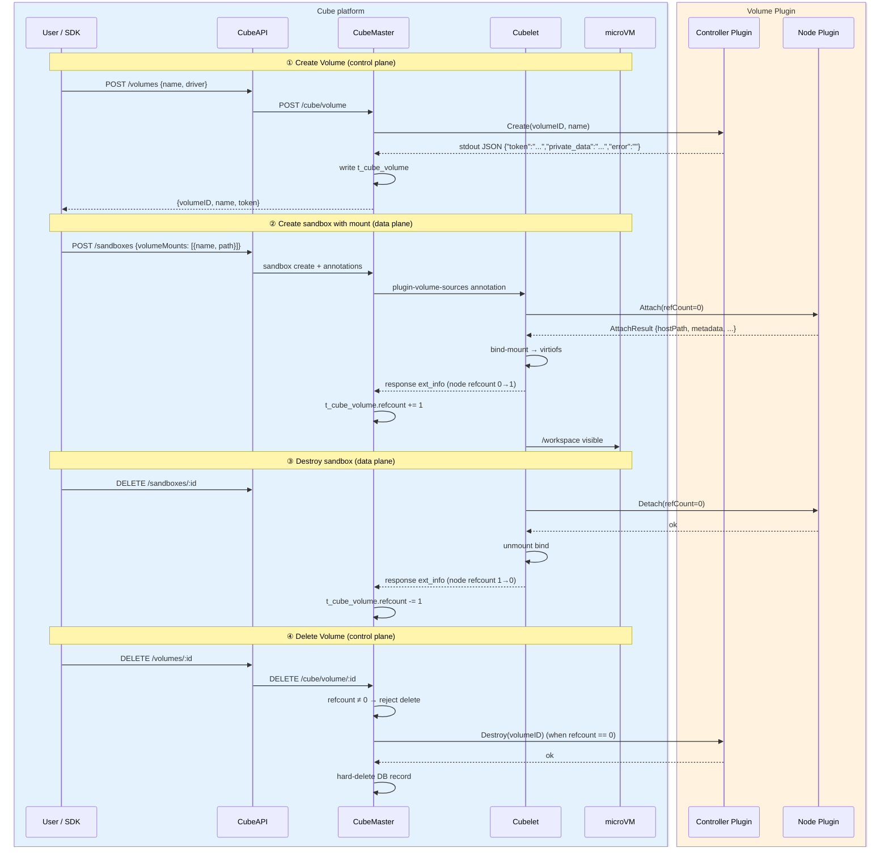

# Volume Plugin Development

CubeSandbox is gradually adopting e2b Volume compatibility to provide persistent storage across sandbox lifecycles. This guide starts from **architecture and core concepts**, then walks through **protocol details and plugin development**, so you can integrate any storage backend (object storage, NFS, distributed file systems, etc.) into CubeSandbox.

> **Version requirement**
>
> Volume features require **Cube platform ≥ 0.6.0** (CubeMaster, CubeAPI, and Cubelet must all be upgraded), plus **Python SDK `cubesandbox` ≥ 0.6.0** (`Volume` and `Sandbox.create(volume_mounts=...)`). Environments below these versions have no Volume API — do not call `/volumes` with an older SDK.

> **Current status** (API / SDK)
>
> | Capability | Status |
> |------------|--------|
> | REST `GET /volumes` — list volumes | ✅ Supported (Cube ≥ 0.6.0) |
> | REST `POST /volumes` — create volume | ✅ Supported |
> | REST `GET /volumes/{volumeID}` — get volume + token | ✅ Supported |
> | REST `DELETE /volumes/{volumeID}` — delete volume | ✅ Supported (409 when still mounted) |
> | SDK `Volume.create` / `connect` / `list` / `get_info` / `destroy` | ✅ Supported (SDK ≥ 0.6.0) |
> | SDK `Sandbox.create(volume_mounts={path: volume})` | ✅ Supported (e2b dict mapping) |
> | One volume mounted by multiple sandboxes | ✅ Supported |
> | Omit `driver` on create (e2b default) | ✅ Supported |

> **e2b API vs SDK**
>
> CubeAPI exposes **e2b-protocol-compatible** `/volumes` REST endpoints. You can call them directly with HTTP clients.
>
> The **official e2b Python SDK cannot be used** against CubeSandbox — it is hardcoded to the e2b.cloud backend. Use the **`cubesandbox` Python SDK** (`Volume`, `Sandbox.create(volume_mounts={...})`) or raw REST against your CubeAPI instance.

---

## Quick start: use Volume with `cubesandbox`

Four steps from plugin to a working SDK demo. Details are in the sections linked below.

### Implement and deploy the plugin

Implement Create / Destroy (Controller) and Attach / Detach (Node) per the [Hook subsections under Core Concepts](#plugin-types). Deploy the Controller side to **CubeMaster** nodes and the Node side to **Cubelet** nodes (same binary or process may serve both).

Reference: [COS plugin](https://github.com/TencentCloud/CubeSandbox/blob/master/examples/volume/cos/README.md) (one-click packages the binary under `CubeMaster/plugin/` and `Cubelet/plugin/`).

### Configure CubeMaster / Cubelet and restart

Register the same `driver` name on both sides (`volume_plugins`), point `binary_path` / `socket_path` at the deployed plugin, then restart CubeMaster and Cubelet so the config is loaded. See [Registration and Configuration](#registration-and-configuration).

### Install the SDK

```bash
pip install 'cubesandbox>=0.6.0'
```

Use **`cubesandbox`**, not the official e2b Python SDK. Set `CUBE_API_URL`, `CUBE_TEMPLATE_ID`, and (for remote I/O) `CUBE_PROXY_NODE_IP`. See [Environment Setup](#environment-setup).

### Run the demo

```python
from cubesandbox import Sandbox, Volume

vol = Volume.create("my-data")  # omit driver → first volume_plugins entry

with Sandbox.create(volume_mounts={"/workspace": vol}) as sb:
    sb.files.write("/workspace/hello.txt", "from volume")
    print(sb.files.read("/workspace/hello.txt"))

Volume.destroy(vol.volume_id)
```

Full lifecycle and multi-sandbox sharing: [SDK Usage](#sdk-usage). COS end-to-end (deps + credentials): [`examples/volume/cos/README.md`](https://github.com/TencentCloud/CubeSandbox/blob/master/examples/volume/cos/README.md).

---

## Core Concepts

> **Diagram legend:** blue fill = Cube platform; orange fill = Volume Plugin (your implementation).

### Problem Statement

Sandboxes need data that **survives restarts and new instances** (model weights, workspace files, etc.). The Cube platform handles API, orchestration, and forwarding; the **Volume Plugin** mounts the real backend (object storage, NFS, …) to a host `hostPath`, which Cubelet exposes to the microVM via virtiofs.

### Dual-Role Model

Inspired by Kubernetes CSI, Hooks split into **control plane** and **data plane**, triggered by different processes:

| Role | Invoked by | Hooks | Responsibility |
|------|------------|-------|----------------|
| **Controller** | CubeMaster | Create / Destroy | Allocate / delete Volume resources in the backend |
| **Node** | Cubelet | Attach / Detach | Mount / unmount on the host; produce `hostPath` |

The same Hook protocol can be implemented as **binary** or **rpc** plugins. All four Hooks may live in one plugin or be split.

#### Control plane: Create / Destroy



#### Data plane: Attach / Detach



Whether **binary** or **rpc**, every plugin must implement the **same Hook fields** below. **binary** maps them to CLI flags / stdout JSON (`snake_case`, e.g. `volume_id` → `--volume-id`, `host_path` in JSON); **rpc** uses the same names in `volumeplugin.proto`. CubeMaster / Cubelet pick the plugin by configured `driver` **before** calling a Hook — **`driver` is not a Hook parameter**.

> **Errors:** **binary** uses non-zero exit and/or non-empty `"error"` in stdout JSON; **rpc** uses gRPC error status (responses have no `error` field).

### Plugin Types

| Type | Controller | Node | Description |
|------|------------|------|-------------|
| **binary** | ✅ | ✅ | External executable; each Hook forks a child process; CLI + stdout JSON |
| **rpc** | ✅ | ✅ | Long-running gRPC plugin; connect via `socket_path` (Unix socket or TCP) |

Config field `type` selects the plugin type; **`name` (driver) must match end-to-end** on CubeMaster and Cubelet. rpc proto definition: [rpc Plugin Proto Definition](#rpc-plugin-proto-definition).

### Hooks

| Hook | Side | Trigger |
|------|------|---------|
| **Create** | Controller | `POST /volumes` |
| **Destroy** | Controller | `DELETE /volumes/:id` |
| **Attach** | Node | Sandbox create (`volumeMounts`) |
| **Detach** | Node | Sandbox destroy or create-failure rollback |

#### Create

| Direction | Field | Type | Description |
|-----------|-------|------|-------------|
| Input | `volumeID` | string | Stable ID (UUID or same as `name`) |
| Input | `name` | string | Display name |
| Output | `token` | string | Optional auth token returned to SDK |
| Output | `private_data` | string | Opaque plugin state (max **1024** bytes). Persisted in `t_cube_volume` and forwarded to **Attach** on sandbox create. **Not** returned to API/SDK clients. May be empty. |
| Output | `error` | string | `""` on success (binary stdout JSON only) |

**binary example**

Input (CLI):

```bash
/path/to/my-plugin --op create --volume-id my-vol --name my-vol
```

Output (stdout JSON, exit 0):

```json
{"token":"","private_data":"","error":""}
```

#### Destroy

| Direction | Field | Type | Description |
|-----------|-------|------|-------------|
| Input | `volumeID` | string | Volume to delete in backend |
| Output | `error` | string | `""` on success (binary stdout JSON only) |

Plugin must locate backend resources using only `volumeID` (e.g. delete prefix `volumes/<volumeID>/`). Destroy does **not** auto-Detach running sandboxes.

**binary example**

Input (CLI):

```bash
/path/to/my-plugin --op destroy --volume-id my-vol
```

Output (stdout JSON, exit 0):

```json
{"error":""}
```

#### Attach

| Direction | Field | Type | Description |
|-----------|-------|------|-------------|
| Input | `sandboxID` | string | Sandbox being created |
| Input | `namespace` | string | containerd namespace |
| Input | `volumeID` | string | Same as `volumeMounts[].name` |
| Input | `refCount` | int64 | Sandbox count **on this node before** attach; `0` = first on this node |
| Input | `volumeBaseDir` | string | Parent dir; `hostPath` **must** be inside it |
| Input | `private_data` | string | Same opaque blob Create returned (from `t_cube_volume`); may be empty. binary: optional `--private-data` (omitted when empty) |
| Output | `hostPath` | string | Path in Cubelet mntns for virtiofs bind |
| Output | `metadata` | map[string]string | Opaque state; echoed back on Detach |
| Output | `error` | string | `""` on success (binary stdout JSON only) |

- `refCount == 0`: **first attach on this node** — perform backend mount.
- `refCount > 0`: **another sandbox on this node** already references the volume — return existing `hostPath` (+ `metadata`); do not mount again.
- **`hostPath`:** absolute path under `volumeBaseDir` (recommended `<volumeBaseDir>/<plugin-name>-<volumeID>`). Otherwise Cubelet rejects attach, rolls back, and fails sandbox create. Default `volumeBaseDir`: `/data/volume`.

**binary example**

Input (CLI):

```bash
/path/to/my-plugin --op attach \
  --sandbox-id sb-001 --namespace default \
  --volume-id my-vol --ref-count 0 \
  --volume-base-dir /data/volume
# optional when Create returned non-empty private_data:
#   --private-data 'volumes/my-vol/'
```

Output (stdout JSON, exit 0):

```json
{"host_path":"/data/volume/my-storage-my-vol","metadata":{"mount_dir":"/data/volume/my-storage-my-vol"},"error":""}
```

#### Detach

| Direction | Field | Type | Description |
|-----------|-------|------|-------------|
| Input | `sandboxID` | string | Same as Attach |
| Input | `namespace` | string | Same as Attach |
| Input | `volumeID` | string | Same as Attach |
| Input | `refCount` | int64 | Sandbox count **on this node after** detach; `0` = last on this node |
| Input | `metadata` | map[string]string | Exact map from Attach |
| Output | `error` | string | `""` on success (binary stdout JSON only) |

- `refCount == 0`: **last sandbox on this node** — tear down shared backend mount (keep persistent data).
- `refCount > 0`: other sandbox(es) on this node still attached — no-op.

**binary example**

Input (CLI):

```bash
/path/to/my-plugin --op detach \
  --sandbox-id sb-001 --namespace default \
  --volume-id my-vol --ref-count 0 \
  --metadata '{"mount_dir":"/data/volume/my-storage-my-vol"}'
```

Output (stdout JSON, exit 0):

```json
{"error":""}
```

### RefCount

One Volume may be shared by multiple sandboxes. Cubelet maintains a **per-node** reference count and passes `refCount` into Node Hooks:

| When | `refCount` | Plugin behavior |
|------|------------|-----------------|
| Before Attach | `0` | First sandbox on **this node**; establish backend mount |
| Before Attach | `> 0` | Another sandbox on **this node** already attached; return existing `hostPath` |
| After Detach | `0` | Last sandbox on **this node**; tear down shared backend mount |
| After Detach | `> 0` | Other sandbox(es) on this node still attached; no-op |

**When a node's local count flips 0→1 or 1→0, Cubelet notifies CubeMaster, which updates `t_cube_volume.refcount`; control-plane `DELETE /volumes` is rejected while that count is non-zero.**



### End-to-End Lifecycle



CubeAPI forwards `volume_mounts` for plugin volumes via the `plugin-volume-mounts` annotation; CubeMaster injects them into each container's `VolumeMounts` before calling Cubelet (see `hostdir_mount.go`).

---

## SDK Usage

Examples below use **Python SDK `cubesandbox` ≥ 0.6.0**. CubeAPI exposes e2b-compatible `/volumes` REST endpoints; applications should prefer the SDK over raw HTTP.

### e2b compatibility note

| Layer | e2b compatible? | Notes |
|-------|-----------------|-------|
| CubeAPI `/volumes` REST | ✅ Yes | `POST/GET/DELETE /volumes`, `GET /volumes/{volumeID}` |
| Official e2b Python SDK | ❌ No | Hardcoded to e2b.cloud; **do not use** with CubeSandbox |
| `cubesandbox` Python SDK | ✅ Yes | `Volume`, `Sandbox.create(volume_mounts={path: volume})` (e2b dict) |
| Omit `driver` on create | ✅ Yes | CubeMaster uses the **first** `volume_plugins` entry |

For a full COS plugin walkthrough, see [`examples/volume/cos/README.md`](https://github.com/TencentCloud/CubeSandbox/blob/master/examples/volume/cos/README.md).

### Environment Setup

```bash
pip install 'cubesandbox>=0.6.0'

export CUBE_API_URL=http://<cubeapi-host>:3000
export CUBE_TEMPLATE_ID=<your-template-id>

# Required for remote access: data plane via CubeProxy, bypassing *.cube.app DNS
export CUBE_PROXY_NODE_IP=<cubeproxy-node-ip>

# Optional when auth is enabled
# export CUBE_API_KEY=<key>
```

| Variable | Description |
|----------|-------------|
| `CUBE_API_URL` | CubeAPI control-plane address |
| `CUBE_TEMPLATE_ID` | Template ID for sandbox creation |
| `CUBE_PROXY_NODE_IP` | CubeProxy node IP; sandbox I/O after mount uses the data plane |
| `CUBE_API_KEY` | Optional; maps to `X-API-Key` when auth is enabled |

### Full Lifecycle (create → mount → unmount → delete)

```python
from cubesandbox import Sandbox, Volume

# ① Create Volume (control plane) → live Volume instance (e2b compatible)
# e2b compatible: omit driver — same as Volume.create("my-data")
vol = Volume.create("my-data")
# Or pick a specific plugin:
# vol = Volume.create("my-data", driver="my-storage")
print(vol.volume_id, vol.name, vol.token)  # token from plugin; may be empty

# List / get_info → VolumeInfo (plain data, not a live handle)
for v in Volume.list():
    print(v.volume_id, v.name)              # list omits token
info = Volume.get_info(vol.volume_id)       # get_info includes token

# Reconnect to an existing volume (e2b Volume.connect)
# vol = Volume.connect(vol.volume_id)

# ② Create sandbox with Volume mount (data plane: Attach)
with Sandbox.create(
    volume_mounts={"/workspace": vol},
) as sb:
    sb.files.write("/workspace/note.txt", "persisted!")
    print(sb.files.read("/workspace/note.txt"))

# ③ Exit with / sb.kill() destroys sandbox (data plane: Detach)

# ④ Delete Volume (control plane: Destroy)
Volume.destroy(vol.volume_id)  # returns True; False when already gone (idempotent)
```

| SDK parameter | Description |
|---------------|-------------|
| `Volume.create(name, driver=...)` | Returns a **Volume instance**; `name` optional; server generates UUID as `volume_id` if omitted; must match `^[a-zA-Z0-9_-]+$`, max 128 chars |
| `Volume.connect(volume_id)` | Returns a **Volume instance** (e2b compatible; wraps `get_info`) |
| `Volume.list()` | Returns `list[VolumeInfo]` (no token) |
| `Volume.get_info(volume_id)` | Returns **VolumeInfo**; includes `token` (empty string when the plugin returns none) |
| `Volume.destroy(volume_id)` | e2b-compatible delete; `True` on success, `False` on 404 (idempotent) |
| `Volume.delete(...)` | Backward-compat alias for `destroy` (prefer `destroy`) |
| `driver` | Optional plugin name; **e2b compatible usage omits it** — SDK sends no field, CubeMaster uses the **first** entry in `volume_plugins` |
| `volume_mounts` | e2b dict `{mount_path: Volume \| volume_id \| name}` — key is path inside sandbox, value is a `Volume` instance or volume ID string |

`driver` is stored in `t_cube_volume` and forwarded to Cubelet via annotations — `volume_plugins[].name` must match on both CubeMaster and Cubelet.

### Multiple Sandboxes Sharing One Volume

```python
# e2b compatible: omit driver (defaults to first plugin in CubeMaster config)
vol = Volume.create("shared-data")
# vol = Volume.create("shared-data", driver="my-storage")

sb_a = Sandbox.create(volume_mounts={"/workspace": vol})
sb_a.files.write("/workspace/shared.txt", "from A")

sb_b = Sandbox.create(volume_mounts={"/workspace": vol})
print(sb_b.files.read("/workspace/shared.txt"))  # from A

sb_a.kill()
sb_b.kill()
Volume.destroy(vol.volume_id)
```

One Volume may be mounted by multiple sandboxes simultaneously; data written from one sandbox is visible to others. Destroy **all** sandboxes using the Volume before calling `Volume.destroy()` (see [RefCount](#refcount) for how the platform tracks shared usage).

### Common SDK Errors

| Scenario | SDK exception | Typical cause |
|----------|---------------|---------------|
| Volume not found | `VolumeNotFoundError` (404) | Invalid ID for `Volume.get_info` / `Volume.connect` |
| Unknown driver | `ApiError` (400, CubeMaster 130400) | No matching `volume_plugins` entry |
| Volume still referenced | `ApiError` (409, CubeMaster 130409) | Delete while the volume is still mounted by a sandbox |
| Invalid volume name | `ValueError` | Client-side validation; name fails `^[a-zA-Z0-9_-]+$` |
| Mount non-existent volume | `ApiError` | Sandbox `volumeMounts[].name` was never created |

> **Note:** When a volume is still mounted by any sandbox, `Volume.destroy()` returns **409**. Destroy all sandboxes using the volume first, then delete. Delete does **not** automatically unmount running sandboxes.

---

## Registration and Configuration

### CubeMaster (conf.yaml)

```yaml
volume_plugins:
  - name: <driver>
    type: binary
    binary_path: <binary_path>

  - name: <driver>
    type: rpc
    socket_path: /run/<driver>.sock   # bare Unix path; plugin SOCKET must match
```

### Cubelet (config.toml)

```toml
[plugins."io.cubelet.internal.v1.storage"]
  volume_plugin_base_dir = "<volume_plugin_base_dir>"

[[plugins."io.cubelet.internal.v1.storage".volume_plugins]]
  name        = "<driver>"
  type        = "binary"       # binary | rpc
  binary_path = "<binary_path>"

[[plugins."io.cubelet.internal.v1.storage".volume_plugins]]
  name        = "<driver>"
  type        = "rpc"
  socket_path = "/run/<driver>.sock"   # same path as plugin SOCKET
```

**`driver` name must be consistent end-to-end:** `Volume.create(..., driver=...)` (or first list entry when omitted) → DB → annotations → Cubelet routes by the same `name`. CubeMaster and Cubelet **`volume_plugins[].name` must match**.

**`volume_plugin_base_dir`:** every plugin `host_path` **must** be under this directory (default `/data/volume` when unset). Cubelet passes it to plugins as `volumeBaseDir` (rpc) / `--volume-base-dir` (binary) and rejects attach if `host_path` is outside it.

**`name` must be unique** within each process: no two `volume_plugins` entries with the same `name`. List order sets the default plugin when API/SDK omits `driver`.

---

## rpc Plugin Proto Definition

rpc plugins implement gRPC services in [`volumeplugin.proto`](https://github.com/TencentCloud/CubeSandbox/blob/master/Cubelet/api/services/volumeplugin/v1/volumeplugin.proto). Message fields match the [Hook definitions](#hooks) above (proto uses `snake_case`).

| File | Description |
|------|-------------|
| [`volumeplugin.proto`](https://github.com/TencentCloud/CubeSandbox/blob/master/Cubelet/api/services/volumeplugin/v1/volumeplugin.proto) | Protocol source |
| [`volumeplugin.pb.go`](https://github.com/TencentCloud/CubeSandbox/blob/master/Cubelet/api/services/volumeplugin/v1/volumeplugin.pb.go) | Generated Go messages |
| [`volumeplugin_grpc.pb.go`](https://github.com/TencentCloud/CubeSandbox/blob/master/Cubelet/api/services/volumeplugin/v1/volumeplugin_grpc.pb.go) | Generated gRPC stubs |

| Service | Caller | RPCs |
|---------|--------|------|
| `VolumeControllerService` | CubeMaster | `Create`, `Destroy` |
| `VolumePluginService` | Cubelet | `Attach`, `Detach` |

Regenerate after editing proto: `cd Cubelet && make proto`. Reference implementation: [`examples/volume/cos/rpc/README.md`](https://github.com/TencentCloud/CubeSandbox/blob/master/examples/volume/cos/rpc/README.md).

---

## Plugin Development Guidelines

When implementing a custom Volume plugin, follow these platform rules:

| # | Guideline | Description |
|---|-----------|-------------|
| 1 | mntns | Node Hooks mount inside **Cubelet mntns**; binary plugins inherit via fork |
| 2 | Idempotent Attach | When `refCount > 0`, another sandbox on this node already attached — return existing `hostPath` |
| 3 | hostPath | **Must** be under `volumeBaseDir` (recommended `<volumeBaseDir>/<driver>-<volumeID>`) |
| 4 | Detach scope | Tear down host mount only (e.g. FUSE unmount); do not delete backend data |
| 5 | Credentials | Keys, bucket, region, etc. managed by the **plugin** (config file, env, …); the framework does not mandate layout |
| 6 | CubeMaster / Cubelet alignment | Both must register the **same `driver` names** in `volume_plugins`; Controller hooks (Create/Destroy) and Node hooks (Attach/Detach) must refer to the **same plugin** for a given Volume |

---

## Reference Implementations

The repo ships a **Tencent Cloud COS** reference plugin (binary Shell + rpc Go) with end-to-end walkthrough and dependency install:

| Doc | Content |
|-----|---------|
| [`examples/volume/cos/README.md`](https://github.com/TencentCloud/CubeSandbox/blob/master/examples/volume/cos/README.md) | Full COS walkthrough (deps, config, SDK verify) |
| [`examples/volume/cos/binary/README.md`](https://github.com/TencentCloud/CubeSandbox/blob/master/examples/volume/cos/binary/README.md) | binary plugin script details |
| [`examples/volume/cos/rpc/README.md`](https://github.com/TencentCloud/CubeSandbox/blob/master/examples/volume/cos/rpc/README.md) | rpc plugin build and deploy |
| [`examples/volume/cos/verify_volume.py`](https://github.com/TencentCloud/CubeSandbox/blob/master/examples/volume/cos/verify_volume.py) | Python SDK verification script |

COS-specific Hook behavior, object layout, trade-offs, and troubleshooting live in those example docs — not duplicated here.

---

## Debugging and Troubleshooting

### Mount Namespace

Cubelet runs in an **isolated mount namespace** via `unshare(CLONE_NEWNS)`. Implementation detail, but important for debugging:

- Node Hook `hostPath` (FUSE, bind, etc.) must exist in **Cubelet mntns**; host root mntns `/proc/mounts` usually won't show them.
- **binary** plugins are forked by Cubelet and inherit mntns — no `nsenter` needed.
- Manual `mount` on the host for debugging often **won't** appear inside sandboxes — trigger Attach via Cubelet or enter Cubelet mntns.

Inspect mounts inside Cubelet mntns:

```bash
CPID=$(pgrep -f "cubelet --config" | head -1)
nsenter -t "$CPID" -m -- mount | grep -E 'volume|fuse'
```

### Manual Plugin Test (binary)

Replace `/path/to/my-plugin` and `my-storage` with your plugin binary and configured `driver` name:

```bash
# Simulate Controller create
/path/to/my-plugin \
  --op create --volume-id test-vol --name test-vol

# Simulate Node attach (first mount); host_path must be under --volume-base-dir
/path/to/my-plugin \
  --op attach --sandbox-id sb-001 --namespace default \
  --volume-id test-vol --ref-count 0 \
  --volume-base-dir /data/volume
```

For COS-specific manual tests, see [`examples/volume/cos/README.md`](https://github.com/TencentCloud/CubeSandbox/blob/master/examples/volume/cos/README.md).

### Common Issues

| Symptom | Likely cause | Check |
|---------|--------------|-------|
| `no plugin registered for driver` | Cubelet missing `volume_plugins` | `config.toml`, restart Cubelet |
| `unknown driver` | CubeMaster not configured or name mismatch | Compare `name` on both sides |
| `volume not found` | `volumeMounts[].name` ≠ existing `volume_id` | Use `volume_id` from `Volume.create` (or pass the `Volume` instance in `volume_mounts`) |
| FUSE OK but invisible in sandbox | Mount in host mntns, not Cubelet mntns | Let Cubelet fork the plugin |
| Detach leak after attach | Unmount shared FUSE when `ref_count > 0` | Follow RefCount semantics |

---

## Known Limitations and Roadmap

Platform behavior (independent of a specific plugin):

| Item | Description |
|------|-------------|
| Delete guard | Reject delete when `t_cube_volume.refcount ≠ 0`; no auto-detach of running sandboxes |
| Refcount via responses | Count updates on sandbox create/destroy **responses**; lost responses may cause brief drift |
| FUSE POSIX semantics | Depends on backend/mount implementation (hard links, atomic rename, etc.) |

---

## Source Index

| Module | Path | Description |
|--------|------|-------------|
| Node interface | `Cubelet/plugins/volume/interface.go` | `VolumePlugin` abstraction |
| Node request types | `Cubelet/plugins/volume/context.go` | `AttachRequest` / `DetachRequest` |
| Controller interface | `CubeMaster/pkg/volume/plugin/plugin.go` | `ControllerPlugin` abstraction |
| Node binary driver | `Cubelet/plugins/volume/binary/driver.go` | Hook → CLI mapping |
| Node rpc driver | `Cubelet/plugins/volume/rpc/driver.go` | Hook → gRPC client |
| Controller binary | `CubeMaster/pkg/volume/plugin/binary/driver.go` | Hook → CLI mapping |
| Controller rpc | `CubeMaster/pkg/volume/plugin/rpc/driver.go` | Hook → gRPC mapping |
| Cross-node refcount | `CubeMaster/pkg/volume/refcount/refcount.go` | Parse ext_info; update `t_cube_volume.refcount` |
| Volume DB model | `CubeMaster/pkg/base/db/models/volume.go` | `VolumeRecord` (includes `refcount`) |
| Plugin volume mount injection | `CubeMaster/pkg/service/sandbox/hostdir_mount.go` | `injectPluginVolumeMounts` from `plugin-volume-mounts` annotation |
| Node mount logic | `Cubelet/storage/pluginvolume.go` | bind-mount + virtiofs; node-level refcount transitions |
| Proto | `Cubelet/api/services/volumeplugin/v1/volumeplugin.proto` | rpc protocol |
| Generated Go | `Cubelet/api/services/volumeplugin/v1/volumeplugin*.pb.go` | Messages / gRPC stubs |
| COS reference (binary) | `examples/volume/cos/binary/cube-volume-cos.sh` | Example binary plugin |
| COS reference (rpc) | `examples/volume/cos/rpc/cmd/cube-volume-cos-rpc` | Example rpc plugin |
