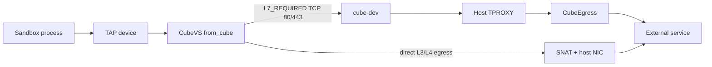
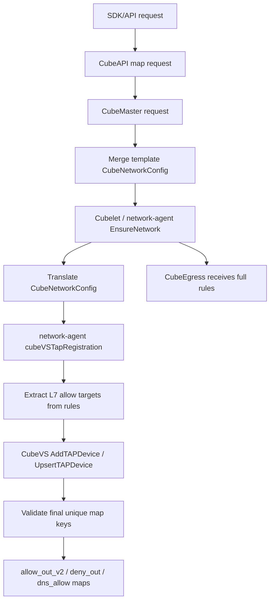
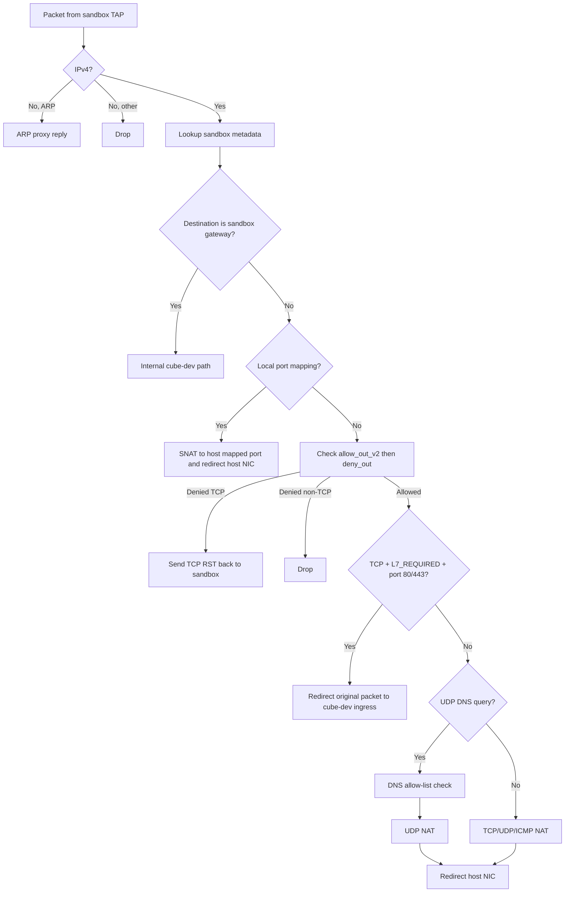

# 出网网络策略

Cube Sandbox 的出网控制不是单一开关，而是由 **API 校验、模板合并、network-agent 下发、CubeVS eBPF 数据面、CubeEgress L7 代理** 共同完成的一条链路。理解这条链路后，配置 `allow_out`、`deny_out` 和 `rules` 时会更容易判断：某个包会被直接转发、被拒绝、被 DNS 学习忽略，还是进入 HTTP/HTTPS 代理。

本文重点说明：

- 用户在 SDK / API 中如何配置出网策略。
- `allow_out`、`deny_out`、`rules` 如何被合并和下发。
- CubeVS 在 `from_cube` 方向逐步如何判断、转发、SNAT 或拒绝。
- DNS 域名 allow-list 如何查询、匹配、学习 A 记录。
- 哪些流量会进入 CubeEgress，哪些不会。
- 常见场景配置示例和排障方法。

请求级的 L7 行为，例如完整的 HTTP/HTTPS 规则匹配、审计日志、header 注入、TLS CA 等，请继续参考 [安全代理](./security-proxy.md)。本文只解释“网络层如何把该进代理的流量送进代理”。

## 总体架构

出网流量从沙箱发出后，大致经过下面几层：



各组件职责如下：

| 组件 | 主要职责 |
| --- | --- |
| CubeAPI | 接收 SDK/API 请求，映射网络配置，并转成 CubeMaster 请求。 |
| CubeMaster | 将模板里的网络配置和本次创建请求里的网络配置合并，然后调度到 Cubelet/network-agent。 |
| network-agent | 把 `CubeNetworkConfig` 转成 CubeVS 可理解的 `MVMOptions`；从 L7 `rules` 中抽取网络可达目标；注册或更新 TAP 的 eBPF map。 |
| CubeVS | 运行在宿主机 eBPF 数据面。负责 per-sandbox L3/L4 allow/deny、配置域名的 DNS A 记录学习、session/NAT、TCP RST 拒绝，以及是否把流量送到 L7 代理。 |
| CubeEgress | 透明 HTTP/HTTPS 代理。只处理被 CubeVS 标记为需要 L7 检查的 TCP/80、TCP/443 流量，执行完整 `rules`。 |

一个关键点是：**出站策略的主动判断发生在沙箱流量进入 TAP 后的 `from_cube` 方向**。宿主机网卡上的 `from_world` 方向主要处理已有会话的回包反向 NAT、端口映射流量，以及 DNS 响应学习；它不是出站 allow/deny 的主判断入口。

## 用户可配置字段

创建沙箱时，以下字段共同决定出网行为：

| 字段 | 配置位置 | 生效层 | 含义 |
| --- | --- | --- | --- |
| `allow_internet_access` | `Sandbox.create(allow_internet_access=...)` | CubeVS | 是否默认允许公网出网。默认 `true`。为 `false` 时，CubeVS 会安装 `0.0.0.0/0` 的 deny-all 规则，然后依靠显式 allow 放行。 |
| `allow_out` | `network["allow_out"]` | CubeVS | 显式允许的 IPv4、CIDR 或 DNS 域名。IP/CIDR 写入 `allow_out_v2`；域名写入 `dns_allow`，通过 DNS 查询和响应学习变成临时 IP allow。 |
| `deny_out` | `network["deny_out"]` | CubeVS | 显式拒绝的 IPv4 或 CIDR。这里不接受域名。 |
| `rules` | `network["rules"]` | CubeVS + CubeEgress | HTTP/HTTPS L7 规则。CubeVS 只抽取其中的 `match.sni` / `match.host` 作为网络可达目标并打上 L7 标记；CubeEgress 才会执行完整 match/action。 |

CubeVS 的基础 IP 策略优先级是：

1. **先查 `allow_out_v2`**：命中则允许；如果条目带 `L7_REQUIRED` 标记，后续 TCP/80、TCP/443 还会被送入 CubeEgress。
2. **再查 `deny_out`**：命中则拒绝。TCP 会尽量返回 RST，非 TCP 直接 drop。
3. **都不命中时默认允许**：除非 `allow_internet_access=false` 已经通过 `deny_out` 安装了 `0.0.0.0/0`。

也就是说，策略优先级是：**allow > deny > default allow**。

::: warning 内置内部网段保护
当 `allow_internet_access` 不是 `false` 时，CubeVS 会默认把沙箱私有网段和宿主机内部网段加入 `deny_out`，包括 `10.0.0.0/8`、`127.0.0.0/8`、`169.254.0.0/16`、`172.16.0.0/12`、`192.168.0.0/16`。这样可以避免工作负载借公共出网策略访问 Cube 内部基础设施。

当 `allow_internet_access=false` 时，后端安装的是 `0.0.0.0/0` 的 deny-all；显式 `allow_out` 和 L7 目标仍然可以优先放行。
:::

## 数量上限

在修改沙箱 eBPF map 之前，CubeVS 会统计由 `allow_out`、`deny_out` 和从 `rules` 抽取出的网络目标生成的最终唯一 map key。超限错误会经 network-agent、Cubelet、CubeMaster 和 CubeAPI 逐层返回给创建沙箱的调用方。

| 最终 map 计数 | 上限 |
| --- | --- |
| `network.allow_out_v2`：来自 `allow_out` 和 `rules[].match.host/sni` 的唯一 IP/CIDR allow key | `8192` 条 |
| `network.deny_out`：最终唯一 deny key；启用内置内部网段时也计入其中 | `8192` 条 |
| `network.dns_allow`：来自 `allow_out` 和 `rules[].match.host/sni` 的唯一域名 key | `1024` 条 |

DNS inner trie 总容量是 `1024` 条域名规则。DNS policy mode 单独存放在 `ifindex_to_mvmmeta` 中，因此 `dns_allow` 不再为模式 marker 保留条目。

等价目标按最终 map key 去重。例如 `198.51.100.1` 和 `198.51.100.1/32` 只算一个 IP key；域名 key 会转为小写并忽略尾部的 `.`。

超限错误会包含最终 map 计数器、实际数量和最大值：

```text
network.allow_out_v2 exceeds maximum entries: got 8193, max 8192
network.deny_out exceeds maximum entries: got 8193, max 8192
network.dns_allow exceeds maximum entries: got 1025, max 1024
```

## 配置语法

### `allow_out`

`allow_out` 用来表达 L3/L4 网络可达性，支持：

- IPv4 地址，例如 `1.1.1.1`，内部按 `/32` 处理。
- IPv4 CIDR，例如 `203.0.113.0/24`。
- 普通 DNS 域名，例如 `api.example.com`。
- 前缀 `*.` 通配域名，例如 `*.example.com`。

通配域名只匹配子域，不匹配 apex 域名：

| 配置 | 匹配 | 不匹配 |
| --- | --- | --- |
| `*.example.com` | `api.example.com`、`a.b.example.com` | `example.com` |
| `example.com` | `example.com` | `api.example.com` |

域名会被转换成小写并去掉尾部的 `.`。只支持合法 DNS 域名；类似 `999.999.999.999` 这种 dotted-decimal 但不是合法 IPv4 的值会被拒绝或忽略。

当 `allow_out` 包含 DNS 域名时，请求必须同时建立 deny-all 兜底。可以二选一：

- 设置 `allow_internet_access=false`，CubeVS 会自动把 `0.0.0.0/0` 写入 `deny_out`。
- 或者显式在 `deny_out` 中包含 `0.0.0.0/0`。

这是因为域名 `allow_out` 需要先通过 DNS A 响应学习成临时 IP allow 条目。如果没有 deny-all 兜底，未学习到的目的 IP 仍会被默认放行，域名 allow-list 就会产生误导。

### `deny_out`

`deny_out` 只支持 IPv4 或 IPv4 CIDR，例如：

```python
network={
    "deny_out": [
        "169.254.169.254/32",
        "10.0.0.0/8",
    ],
}
```

`deny_out` 不支持域名。原因是拒绝域名需要处理 DNS 解析、多 A 记录、TTL、CNAME、缓存污染等问题，而当前拒绝逻辑是纯 IP/CIDR LPM 匹配。

在 `allow_internet_access=false` 的严格模式下，`0.0.0.0/0` 已经作为兜底拒绝安装到 `deny_out`。这时额外配置更窄的 `deny_out` 通常只是表达意图，不会比 deny-all 更严格；真正需要配置的是要放行的 `allow_out` 或带 `host` / `sni` 的 L7 `rules`。

### `rules`

`rules` 是 L7 HTTP/HTTPS 规则，完整规则由 CubeEgress 执行。每条规则通常包含：

- `name`：规则名，用于审计和模板合并。
- `match.scheme`：`http` 或 `https`。
- `match.sni`：TLS SNI。支持普通域名和 `*.` 通配域名。
- `match.host`：HTTP Host。支持域名、`host:port`、IPv4、IPv4 CIDR 和 `*.` 通配域名。
- `match.method`：HTTP 方法列表，方法之间是 OR。
- `match.path`：默认精确匹配；尾部 `*` 表示前缀匹配，例如 `/v1/*`。
- `action.allow`：`true` 放行，`false` 拒绝。
- `action.audit`：审计级别，例如 `metadata`、`full`、`none`。
- `action.inject`：可选 header 注入，仅在 allow 且 HTTPS 条件满足时生效。

多个字段之间是 AND 关系。例如同时设置 `scheme=https`、`sni=api.example.com`、`method=["POST"]`、`path=/v1/*`，表示这些条件都满足才匹配。

::: tip 受限出网场景下，L7 规则要写 `host` 或 `sni`
CubeVS 只会从 `rules[].match.sni` 和 `rules[].match.host` 抽取网络可达目标。`method`、`path`、`scheme` 只能在 CubeEgress 里判断，无法告诉 CubeVS 目标 IP 应该被放行或送入代理。

因此，当 `allow_internet_access=false` 时，每条需要真正访问外部 HTTP/HTTPS 服务的 L7 规则都应该包含 `host` 或 `sni`。只写 `method` 和 `path` 的规则可能永远到不了 CubeEgress，因为网络层不知道该允许哪个目的 IP。
:::

## 控制面合并与下发流程

从用户请求到 eBPF map，大致流程如下：



### 1. CubeAPI 映射和转发

CubeAPI 接收用户的 `SandboxNetworkConfig`，正确配置方式如下：

```python
network={
    "allow_out": ["api.example.com"],
    "deny_out": ["203.0.113.0/24"],
    "rules": [...],
}
```

CubeAPI 会把请求映射成 CubeMaster 的 `CubeNetworkConfig`，并转发 `allow_out`、`deny_out` 和完整的 `rules` 列表。

### 2. CubeMaster 与模板合并

如果模板里也带了 `CubeNetworkConfig`，CubeMaster 会把模板配置和用户请求配置合并：

- `allowInternetAccess`：如果请求中显式设置，则覆盖模板值。
- `allowOut`：把请求列表追加到模板列表后，并按字符串去重。
- `denyOut`：把请求列表追加到模板列表后，并按字符串去重。
- `rules`：按 `name` 合并。同名规则由请求侧覆盖；不同名规则追加到模板规则后面，保留 first-match-wins 的顺序。

合并后的 `CubeNetworkConfig` 会发给 Cubelet/network-agent。network-agent 抽取 L7 网络可达目标后，由 CubeVS 校验最终唯一 eBPF map key。

### 3. network-agent 提取 CubeVS 目标

network-agent 收到 `CubeNetworkConfig` 后，会构造 CubeVS 的 `MVMOptions`：

- `AllowInternetAccess`：未设置时默认 `true`。
- `AllowOut`：直接来自用户/模板合并后的 `allowOut`。
- `DenyOut`：直接来自用户/模板合并后的 `denyOut`。
- `L7AllowOut`：从每条 `rules[].match.sni` 和 `rules[].match.host` 中抽取。

L7 目标抽取规则：

| 来源 | 处理方式 |
| --- | --- |
| `match.sni` | 只接受合法域名或 `*.` 通配域名；转小写，去掉尾部 `.`；不接受 IP。 |
| `match.host` 为 `host:port` | 去掉端口，只保留 host。 |
| `match.host` 为 IPv4 | 保留为 `/32` 形式的 IP 目标。 |
| `match.host` 为 IPv4 CIDR | 保留 CIDR。 |
| `match.host` 为域名或 `*.` 通配域名 | 规范化为小写域名目标。 |
| 无效 host/SNI | 不作为 CubeVS 目标下发。 |

例如：

```python
rules = [
    Rule(match=Match(sni="API.Example.COM."), action=Action(allow=True)),
    Rule(match=Match(host="gateway.example.com:8443"), action=Action(allow=True)),
    Rule(match=Match(host="1.2.3.4:443"), action=Action(allow=True)),
    Rule(match=Match(host="10.1.2.3/8"), action=Action(allow=True)),
]
```

会抽取出类似目标：

```text
api.example.com
gateway.example.com
1.2.3.4
10.0.0.0/8
```

这些目标和普通 `allow_out` 的区别是：它们会带上 `L7_REQUIRED` 标记。

### 4. CubeVS map 写入

network-agent 最终把不同来源写入不同 map：

| 来源 | 写入位置 | 是否带 `L7_REQUIRED` | 作用 |
| --- | --- | --- | --- |
| `allow_out` IPv4/CIDR | `allow_out_v2[ifindex]` | 否 | 允许直接 L3/L4 出网。 |
| `allow_out` 域名 | `dns_allow[ifindex]` | 否 | 跟踪匹配的 DNS A 查询，并把响应中的 A 记录临时学习到 `allow_out_v2`。要求同时设置 `allow_internet_access=false` 或显式 `deny_out=["0.0.0.0/0"]`，避免未学习 IP 被默认放行。 |
| `rules[].match.host/sni` IPv4/CIDR | `allow_out_v2[ifindex]` | 是 | 允许访问该 IP/CIDR，并让 TCP/80、TCP/443 进入 CubeEgress。 |
| `rules[].match.host/sni` 域名 | `dns_allow[ifindex]` | 是 | 跟踪匹配的 DNS A 查询并学习带 L7 标记的 IP；它本身不会影响无关 DNS 名称。 |
| `deny_out` | `deny_out[ifindex]` | 不适用 | 拒绝匹配目的 IP/CIDR 的流量，除非先命中 allow。 |
| 内置内部网段 | `deny_out[ifindex]` | 不适用 | 防止访问 Cube 内部基础设施。 |
| `allow_internet_access=false` | `deny_out[ifindex]` | 不适用 | 写入 `0.0.0.0/0` deny-all。 |

如果同一个 IP/CIDR 既来自普通 `allow_out`，又来自 L7 规则，CubeVS 会保留 `L7_REQUIRED` 标记。静态 `allow_out` 条目不过期；DNS 学习出的条目带 `expires_at_ns`，会按 TTL 过期。

## `from_cube` 如何判断和转发

`from_cube` 是挂在沙箱 TAP ingress 上的 TC eBPF 程序。每个沙箱发出的包都会先进入这里。处理顺序可以理解为下面几个阶段。



### 1. 非 IPv4 和 ARP

CubeVS 主要处理 IPv4 出网。ARP 请求会由 eBPF 直接构造 ARP reply，使沙箱认为网关存在。其他非 IPv4 包会被丢弃。

### 2. 访问沙箱网关 / cube-dev

如果目的地址是沙箱网关 `169.254.68.5`，这是内部到 `cube-dev` 的路径，不按普通公网出站策略处理。当前逻辑只允许：

- ICMP。
- TCP 非 SYN 包。

TCP SYN 和其他协议会被丢弃。允许的内部包会被 DNAT 到 `cubegw0_ip`，再重定向到 `cube-dev`。

### 3. 本地端口映射优化

对 TCP 流量，`from_cube` 会检查 `local_port_mapping`。如果沙箱源端口对应某个宿主机端口映射，CubeVS 会执行端口 SNAT 并直接重定向到宿主机网卡。这是端口映射场景的优化路径。

### 4. 出站网络策略

普通外部流量进入 `check_net_policy`：

1. 用目的 IP 在 `allow_out_v2[ifindex]` 中做 LPM 查找。
   - 命中且未过期：允许。
   - 如果 value 中有 `NET_POLICY_FLAG_L7_REQUIRED`，后续 TCP/80、TCP/443 会进代理。
2. 未命中 allow 时，用目的 IP 在 `deny_out[ifindex]` 中做 LPM 查找。
   - 命中：拒绝。
3. allow/deny 都没命中：默认允许。

对于被拒绝的包：

- TCP：CubeVS 会尽量原地构造一个 TCP RST 回给沙箱，所以用户态通常看到的是 `Connection refused` 或连接立即失败，而不是长时间 timeout。
- UDP/ICMP：直接丢弃。

::: tip TCP 非 SYN 无 session 的处理
对 TCP 出站 NAT 来说，只有 `SYN && !ACK && !FIN && !RST` 的首包才能创建新 session。后续 TCP 包必须能在 `egress_sessions` 中查到已有 session。若沙箱发出一个非 SYN 的 TCP 包但没有 session，CubeVS 会返回 TCP RST，而不是为它新建连接。

这个逻辑发生在 `from_cube` 方向。`from_world` 方向只对已有 `ingress_sessions` 做回包反向 NAT，没有命中的包通常放行给内核继续处理，而不是执行出站策略拒绝。
:::

### 5. L7 代理路径

当一个 TCP 包满足下面条件时，CubeVS 不会做普通 SNAT 出网，而是把原始包重定向到 `cube-dev` ingress：

- 命中了 `allow_out_v2`。
- 命中的 value 带 `L7_REQUIRED` 标记。
- 目的端口是 TCP `80` 或 `443`。

随后宿主机 TPROXY 规则会按 `iif cube-dev + dport 80/443` 匹配，把连接交给 CubeEgress。CubeEgress 再根据完整 `rules` 判断 `scheme`、`sni`、`host`、`method`、`path`、`action`、`audit`、`inject`。

### 6. 普通 NAT/session 路径

不需要 L7 的 TCP/UDP/ICMP 会走 CubeVS NAT/session：

- TCP：只有 SYN 首包创建 session；后续包更新 TCP conntrack 状态。
- UDP：首个出站包创建 `UNREPLIED` session，收到回包后进入 `REPLIED`。
- ICMP：只处理 Echo Request，identifier 用作类似端口的 session key。

SNAT 会把沙箱内部源地址 `169.254.68.6` 改写为宿主机可路由的 SNAT IP，并分配动态源端口，然后重定向到宿主机网卡。

## DNS 域名 allow-list 和学习

域名策略是这套机制里最容易误解的部分。CubeVS 并不是直接“允许域名”，因为真实数据包只有目的 IP。它的做法是：**跟踪已配置域名的 DNS A 查询，再把匹配响应中的 A 记录学习成临时 IP allow 条目**。没有配置的域名不会在 DNS 阶段被拦截；它们只是不会创建学习到的 IP allow 条目。

### DNS allow map 的结构

每个沙箱有一个 `dns_allow[ifindex]` inner map。它是 LPM trie，key 是反转后的域名：

| 配置 | 反转 key 思路 | 匹配语义 |
| --- | --- | --- |
| `example.com` | `moc.elpmaxe\0` | 精确匹配 `example.com`。 |
| `*.example.com` | `moc.elpmaxe.` | 匹配子域，例如 `api.example.com`，不匹配 `example.com`。 |

`dns_allow` 只存域名规则和规则自身的标记，例如 `L7_REQUIRED`。沙箱级 DNS policy mode 存放在 `ifindex_to_mvmmeta[].dns_policy_flags` 中：

| 模式 | 域名来源 | 查询行为 | 学习行为 |
| --- | --- | --- | --- |
| Off | `allow_out` 和 L7 rules 都没有域名 | DNS 按普通 UDP 出站。 | 不进行 DNS 响应学习。 |
| Track | 至少有一个 `allow_out` 域名或 L7 rules 域名 | 所有域名都放行；只跟踪命中的已配置域名。 | 命中的 A 记录会学习到 `allow_out_v2`，并保留 L7 标记。 |

`allow_out` 域名和 L7 rule 域名都会开启 DNS 学习。两者都不会把 DNS 本身变成 allow-list，CubeVS 也不再为未命中的域名返回合成 NXDOMAIN。

### DNS 查询阶段

当沙箱发出 UDP/53 查询时，`from_cube` 会尝试解析 DNS payload：

1. 只处理标准、格式正确的 IN A 查询。
2. 解析 QNAME，转成小写，再反转成 LPM trie key。
3. 如果模式为 Off，走普通 UDP NAT。
4. CubeVS 用反转后的 QNAME 匹配域名规则。
5. 如果域名未命中，查询正常走 UDP NAT，但不会创建 pending learning entry。
6. 如果域名匹配，CubeVS 会在 `dns_query_track` 写入一个 pending query，key 包含：
   - sandbox ifindex
   - DNS server IP
   - UDP 源端口
   - DNS ID
   - QNAME hash
7. pending query 的生命周期是 `10` 秒。
8. 查询本身继续走 UDP NAT 发往真实 DNS server。

因此，无关域名的 DNS 解析在普通 UDP 出网可用时仍会成功。在严格域名 allow-list 配置下，无关目标的失败点在后续 IP 连接阶段：由于没有 DNS 学习出的 allow 条目，目的 IP 会被 deny-all 兜底拒绝。

### DNS 响应阶段

DNS 响应从外部回来时，先进入宿主机网卡上的 `from_world`：

1. `from_world` 通过 `ingress_sessions` 找到对应 UDP session。
2. 如果这是 DNS server 端口 `53` 的响应，会先调用 DNS 响应学习逻辑。
3. 只有 `ifindex_to_mvmmeta[].dns_policy_flags` 带 learning flag 时才执行学习，并且响应必须匹配之前 `dns_query_track` 中的 pending query。
4. 只学习 IPv4 A 记录；AAAA / IPv6 不会写入 `allow_out_v2`。
5. 最多处理响应中的前 `8` 个 answer。
6. 学到的 IP 以 `/32` 写入 `allow_out_v2[ifindex]`，`expires_at_ns` 按 DNS TTL 计算。
7. 如果原 DNS allow 规则带 `L7_REQUIRED`，学习出的 IP 也继承这个标记。
8. 学习完成或失败后，pending query 会被删除。
9. 响应包继续做反向 NAT，返回沙箱。

如果同一个 IP 已经是静态 `allow_out`，DNS 学习不会把它变成会过期的临时条目；静态条目会保持不过期，同时合并 flags。

### DNS 回收

network-agent / CubeVS 用户态侧有 reaper 定期扫描：

- `allow_out_v2`：删除已经过期的 DNS-learned 临时条目。
- `dns_query_track`：删除超过 `10` 秒仍未收到响应的 pending query。

因此，如果域名 DNS TTL 很短，对应 IP allow 也会较快过期；下一次访问前需要再次 DNS 查询并学习。

::: warning 当前只学习 IPv4 A 记录
动态域名授权路径当前只学习 IPv4 A 记录。IPv6 / AAAA 响应不会进入 `allow_out_v2`，`deny_out` 也仍然是 IPv4/IP-CIDR 策略。
:::

## 哪些流量会进入 CubeEgress

CubeEgress 并不会看到所有出站包。进入 CubeEgress 必须同时满足“网络目标来自 L7 规则”和“端口是 HTTP/HTTPS 透明代理端口”。

| 流量 | 是否进入 CubeEgress | 原因 |
| --- | --- | --- |
| TCP 目的端口 `80`，目的 IP 命中带 `L7_REQUIRED` 的 `allow_out_v2` | 是 | HTTP 需要由 CubeEgress 执行完整 `rules`。 |
| TCP 目的端口 `443`，目的 IP 命中带 `L7_REQUIRED` 的 `allow_out_v2` | 是 | HTTPS 需要由 CubeEgress 根据 SNI/Host 等执行规则。 |
| TCP `80/443`，但目的 IP 只来自普通 `allow_out`，没有 L7 标记 | 否 | 只做 L3/L4 放行和 NAT。 |
| TCP 非 `80/443`，即使命中 L7 目标 | 否 | CubeEgress 是 HTTP/HTTPS 透明代理，目前只接管 80/443。 |
| UDP/53 DNS 查询 | 否 | 由 CubeVS DNS 学习逻辑处理。 |
| UDP、ICMP、其他 TCP 端口 | 否 | 走 CubeVS NAT/session。 |
| 命中 `deny_out` 且没有先命中 allow 的流量 | 否 | 在 CubeVS 侧拒绝。 |
| `from_world` 回包 | 否 | 回包方向按 session 做反向 NAT，不做 L7 代理入口判断。 |

举例：

```python
rules = [
    Rule(
        name="allow_api",
        match=Match(scheme="https", sni="api.example.com", host="api.example.com"),
        action=Action(allow=True),
    )
]
```

这条规则会让 `api.example.com` 被写入 `dns_allow`，并带上 `L7_REQUIRED`。沙箱访问时流程是：

1. 沙箱查询 `api.example.com` 的 A 记录。
2. CubeVS 允许 DNS 查询，并记录 pending query。
3. DNS 响应回来，CubeVS 学习 A 记录，例如 `203.0.113.10/32`，并打上 `L7_REQUIRED`。
4. 沙箱连接 `203.0.113.10:443`。
5. `from_cube` 命中带 L7 标记的 `allow_out_v2` 条目，重定向到 `cube-dev`。
6. TPROXY 把连接交给 CubeEgress。
7. CubeEgress 检查完整规则，决定 allow/deny/audit/inject。

## 常见配置示例

### 示例 1：完全禁止公网

适合纯离线代码执行、数据处理等场景：

```python
from cubesandbox import Sandbox

with Sandbox.create(
    template="tpl_xxx",
    allow_internet_access=False,
) as sb:
    result = sb.commands.run("curl -m 2 https://example.com")
    print(result.stderr)
```

效果：

- CubeVS 安装 `0.0.0.0/0` deny-all。
- 没有显式 `allow_out` 或 L7 目标时，普通外部访问都会被拒绝。
- TCP 通常快速收到 RST；UDP/ICMP 通常被 drop。

### 示例 2：只允许访问固定 IP/CIDR

适合只允许访问固定出口服务、内网服务或指定 DNS server 的场景：

```python
from cubesandbox import Sandbox

with Sandbox.create(
    template="tpl_xxx",
    allow_internet_access=False,
    network={
        "allow_out": [
            "1.1.1.1/32",
            "203.0.113.0/24",
        ],
    },
) as sb:
    sb.commands.run("curl http://1.1.1.1")
```

效果：

- `1.1.1.1/32` 和 `203.0.113.0/24` 写入 `allow_out_v2`。
- `0.0.0.0/0` 在 `deny_out` 中作为兜底拒绝。
- allow 优先级高于 deny，所以这两个目标仍然可访问。

### 示例 3：默认允许公网，但拒绝敏感地址段

适合保留一般公网访问，同时阻断元数据地址或敏感内网：

```python
from cubesandbox import Sandbox

with Sandbox.create(
    template="tpl_xxx",
    allow_internet_access=True,
    network={
        "deny_out": [
            "169.254.169.254/32",
            "10.0.0.0/8",
        ],
    },
) as sb:
    sb.commands.run("curl https://example.com")
```

效果：

- 未命中 deny 的公网目标默认允许。
- 命中 `deny_out` 的目标被拒绝。
- 如果某个目标同时也被 `allow_out` 放行，则 allow 优先。

### 示例 4：只允许访问指定域名

适合“只允许访问某几个域名，但不做 HTTP 请求级检查”的场景：

```python
from cubesandbox import Sandbox

with Sandbox.create(
    template="tpl_xxx",
    allow_internet_access=False,
    network={
        "allow_out": [
            "api.github.com",
            "*.example.com",
        ],
    },
) as sb:
    sb.commands.run("curl https://api.github.com")
```

效果：

- `api.github.com` 和 `*.example.com` 写入 `dns_allow`。
- 允许匹配域名的 DNS A 查询。
- DNS 响应中的 A 记录临时写入 `allow_out_v2`。
- 后续到这些 IP 的 TCP/443 直接 NAT 出网，不进入 CubeEgress，因为普通 `allow_out` 没有 L7 标记。

注意：如果应用跳过 DNS，直接访问域名当前解析出的 IP，而该 IP 尚未通过沙箱 DNS 查询被学习，严格 allow-list 下会被 deny-all 拒绝。

### 示例 5：使用 L7 规则限制 HTTP 方法和路径

适合只允许调用某个 API 的特定路径：

```python
from cubesandbox import Sandbox, Rule, Match, Action

rules = [
    Rule(
        name="allow_deepseek_chat",
        match=Match(
            scheme="https",
            sni="api.deepseek.com",
            host="api.deepseek.com",
            method=["POST"],
            path="/v1/*",
        ),
        action=Action(allow=True, audit="metadata"),
    ),
]

with Sandbox.create(
    template="tpl_xxx",
    allow_internet_access=False,
    network={"rules": rules},
) as sb:
    sb.commands.run("curl -s https://api.deepseek.com/v1/chat/completions")
```

效果：

- `api.deepseek.com` 从 `sni` / `host` 中被抽取为 L7 allow target。
- DNS A 记录学习到的 IP 带 `L7_REQUIRED`。
- TCP/443 进入 CubeEgress。
- CubeEgress 执行 `scheme`、`sni`、`host`、`method`、`path` 的完整匹配。

### 示例 6：L7 deny 返回请求级 403

如果希望对某类 HTTP/HTTPS 请求返回明确的请求级拒绝，而不是网络层 drop，可以写 deny 规则：

```python
from cubesandbox import Sandbox, Rule, Match, Action

rules = [
    Rule(
        name="deny_example_subdomains",
        match=Match(scheme="https", sni="*.example.net"),
        action=Action(allow=False, audit="metadata"),
    ),
]

with Sandbox.create(
    template="tpl_xxx",
    allow_internet_access=False,
    network={"rules": rules},
) as sb:
    sb.commands.run("curl -i https://api.example.net")
```

效果：

- 虽然 `action.allow=False`，但 `*.example.net` 仍会作为 L7 target 下发给 CubeVS。
- 这样 TCP/443 能进入 CubeEgress。
- CubeEgress 匹配 deny 规则后返回请求级 403，并记录审计信息。

如果不把目标送入 CubeEgress，底层网络策略只能 drop/RST，无法产生 HTTP 403。

### 示例 7：混合 L3 allow 和 L7 rules

```python
from cubesandbox import Sandbox, Rule, Match, Action

rules = [
    Rule(
        name="allow_payment_api",
        match=Match(
            scheme="https",
            sni="pay.example.com",
            host="pay.example.com",
            method=["POST"],
            path="/api/payments/*",
        ),
        action=Action(allow=True, audit="full"),
    ),
]

with Sandbox.create(
    template="tpl_xxx",
    allow_internet_access=False,
    network={
        "allow_out": [
            "1.1.1.1/32",        # e.g. DNS resolver or fixed service
            "downloads.example.com",
        ],
        "deny_out": ["203.0.113.0/24"],
        "rules": rules,
    },
) as sb:
    sb.commands.run("curl https://pay.example.com/api/payments/create")
```

效果：

- `1.1.1.1/32` 静态放行，不进 CubeEgress。
- `downloads.example.com` 通过 DNS 学习后放行，不进 CubeEgress。
- `pay.example.com` 通过 DNS 学习后带 `L7_REQUIRED`，TCP/443 进 CubeEgress。
- `203.0.113.0/24` 会被拒绝，除非某个具体 IP 同时先命中了 allow。

## 行为速查表

| 配置 | 目标 | 结果 |
| --- | --- | --- |
| `allow_internet_access=True`，无 `allow_out`/`deny_out`/`rules` | 普通公网 IP | 默认允许，走 NAT。 |
| `allow_internet_access=False`，无 allow | 任意公网 IP | 被 `0.0.0.0/0` 拒绝。TCP RST，非 TCP drop。 |
| `allow_internet_access=False` + `allow_out=["1.1.1.1"]` | `1.1.1.1` | 允许，走 NAT。 |
| `allow_internet_access=False` + `allow_out=["api.example.com"]` | 先 DNS，再访问学习到的 IP | DNS A 响应学习后允许，走 NAT。 |
| `allow_internet_access=False` + `rules` 中有 `sni="api.example.com"` | `api.example.com:443` | DNS 学习出的 IP 带 L7 标记，TCP/443 进入 CubeEgress。 |
| `rules` 只写 `path="/v1/*"`，没有 `host`/`sni` | 严格 allow-list | 可能到不了 CubeEgress，因为 CubeVS 没有网络目标可放行。 |
| `deny_out=["203.0.113.0/24"]` | `203.0.113.10` | 若未先命中 allow，则拒绝。 |
| `allow_out=["203.0.113.10"]` + `deny_out=["203.0.113.0/24"]` | `203.0.113.10` | allow 优先，允许。 |
| `allow_out=["*.example.com"]` | `example.com` | 不匹配。 |
| `allow_out=["*.example.com"]` | `api.example.com` | 匹配。 |

## 观测与排障

### 查看 CubeVS map

`cubevsmapdump` 是宿主机侧查看 CubeVS 业务 map 的工具。发布/安装包会把它安装到正常命令路径中，部署节点上直接使用即可：

```bash
sudo cubevsmapdump --list-maps
sudo cubevsmapdump --map dns_allow,dns_query_track,allow_out_v2,deny_out
sudo cubevsmapdump --ifindex tapxxx --map dns_allow,allow_out_v2,deny_out
```

常用字段：

| 字段 | 含义 |
| --- | --- |
| `ifindex_to_mvmmeta[].dns_policy_flags` | 沙箱级 DNS policy mode 的原始 flags。 |
| `ifindex_to_mvmmeta[].dns_learning_enabled` | 表示当前沙箱是否启用 DNS 响应学习。 |
| `dns_allow[].rules[].domain` | 当前沙箱安装的域名策略规则。 |
| `dns_allow[].rules[].l7_required` | 这个域名学习出的 IP 后续是否需要进入 CubeEgress。 |
| `dns_allow[].enabled` / `learning_enabled` / `flags` | 兼容展示字段，数据来自 `ifindex_to_mvmmeta`，不是 `dns_allow` 中存储的条目。 |
| `dns_query_track` | 当前正在等待响应的 DNS 查询，通常生命周期很短。 |
| `allow_out_v2[].entries[].expires_at_ns` / `expires_in` | `0` 或空表示静态 allow；非零表示 DNS 学习出的临时条目。 |
| `allow_out_v2[].entries[].l7_required` | 访问该 IP 的 TCP/80、TCP/443 是否进入 CubeEgress。 |
| `deny_out` | 当前沙箱的 deny CIDR，包括用户配置、内置内部网段或 deny-all。 |

### 查看服务状态

```bash
sudo systemctl status cube-sandbox-network-agent.service
sudo systemctl status cube-sandbox-cube-egress.service
sudo systemctl restart cube-sandbox-compute.target
```
