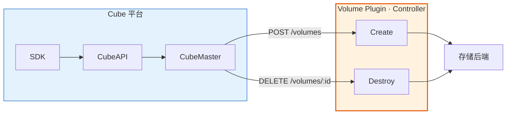
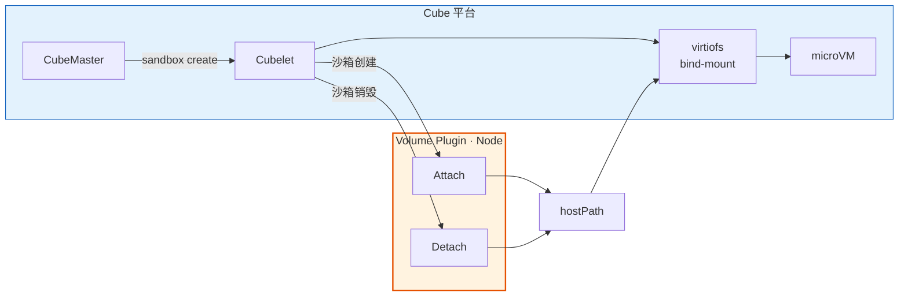
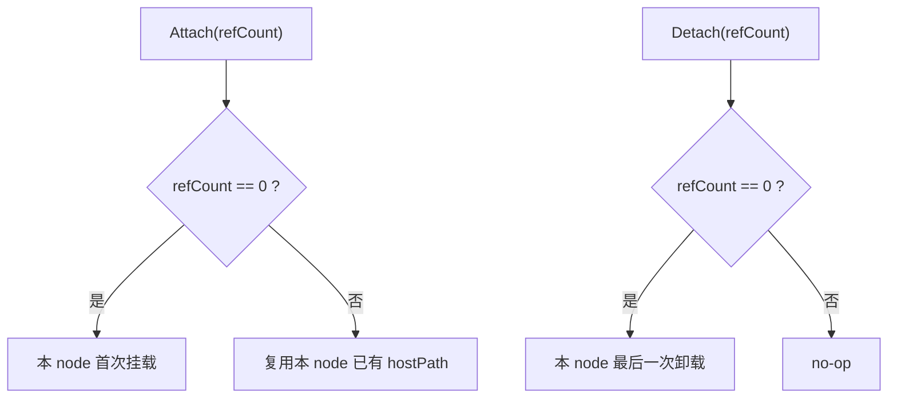
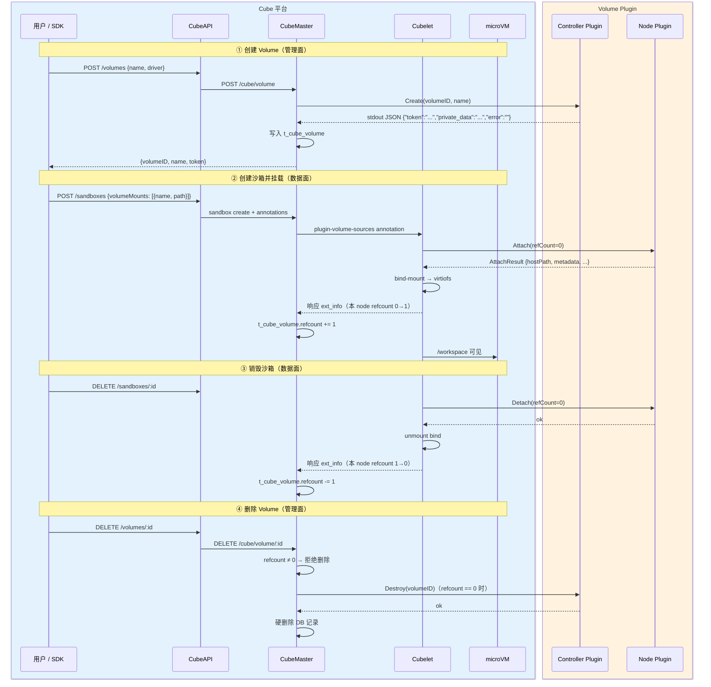

# Volume 插件开发指南

CubeSandbox 正在逐步兼容 e2b Volume，为沙箱提供跨生命周期的持久化存储。本文档从**整体架构与核心原理**出发，逐步深入到**协议细节与插件开发**，帮助你将任意存储后端（对象存储、NFS、分布式文件系统等）接入 CubeSandbox。

> **版本要求**
>
> Volume 能力需要 **Cube 平台 ≥ 0.6.0**（CubeMaster、CubeAPI、Cubelet 均需升级），以及 **Python SDK `cubesandbox` ≥ 0.6.0**（提供 `Volume` 与 `Sandbox.create(volume_mounts=...)`）。低于上述版本的环境无 Volume API，请勿混用旧版 SDK 调用 `/volumes`。

> **当前进展**（API / SDK）
>
> | 能力 | 状态 |
> |------|------|
> | REST `GET /volumes` — 列出 Volume | ✅ 已支持（Cube ≥ 0.6.0） |
> | REST `POST /volumes` — 创建 Volume | ✅ 已支持 |
> | REST `GET /volumes/{volumeID}` — 查询 Volume + token | ✅ 已支持 |
> | REST `DELETE /volumes/{volumeID}` — 删除 Volume | ✅ 已支持（仍被挂载时返回 409） |
> | SDK `Volume.create` / `connect` / `list` / `get_info` / `destroy` | ✅ 已支持（SDK ≥ 0.6.0） |
> | SDK `Sandbox.create(volume_mounts={path: volume})` | ✅ 已支持（e2b dict 映射） |
> | 同一 Volume 被多个沙箱同时挂载 | ✅ 已支持 |
> | 创建时省略 `driver`（e2b 默认行为） | ✅ 已支持 |

> **e2b API 与 SDK**
>
> CubeAPI 提供 **与 e2b 协议兼容** 的 `/volumes` REST 接口，可直接用 HTTP 客户端调用。
>
> **官方 e2b Python SDK 不能用于 CubeSandbox** — 其请求硬编码指向 e2b.cloud 后端。请使用 **`cubesandbox` Python SDK**（`Volume`、`Sandbox.create(volume_mounts={...})`），或对自有 CubeAPI 实例发起 REST 请求。

---

## 快速上手：用 `cubesandbox` 使用 Volume 插件

从插件到 SDK 跑通，只需四步。细节见下文各节链接。

### 按协议开发插件并部署到对应节点

按 [核心原理](#核心原理) 中的 [插件类型](#插件类型) 与各 Hook 小节实现 Create / Destroy（Controller）与 Attach / Detach（Node）。Controller 部署到 **CubeMaster** 节点，Node 部署到 **Cubelet** 节点（同一二进制/进程可同时承担两侧）。

参考实现：[COS 插件](https://github.com/TencentCloud/CubeSandbox/blob/master/examples/volume/cos/README.zh.md)（one-click 会将 binary 插件放到 `CubeMaster/plugin/` 与 `Cubelet/plugin/`）。

### 配置 CubeMaster / Cubelet 并重启

两侧 `volume_plugins` 使用相同的 `driver` 名，`binary_path` / `socket_path` 指向已部署的插件；修改后重启 CubeMaster 与 Cubelet 使配置生效。见 [注册与配置](#注册与配置)。

### 安装 cubesandbox SDK ≥ 0.6.0

```bash
pip install 'cubesandbox>=0.6.0'
```

须使用 **`cubesandbox`**，不可用官方 e2b Python SDK。配置 `CUBE_API_URL`、`CUBE_TEMPLATE_ID`，远程读写时还需 `CUBE_PROXY_NODE_IP`。见 [环境准备](#环境准备)。

### 运行 demo

```python
from cubesandbox import Sandbox, Volume

vol = Volume.create("my-data")  # 省略 driver → 取 volume_plugins 第一项

with Sandbox.create(volume_mounts={"/workspace": vol}) as sb:
    sb.files.write("/workspace/hello.txt", "from volume")
    print(sb.files.read("/workspace/hello.txt"))

Volume.destroy(vol.volume_id)
```

完整生命周期与多沙箱共用见 [SDK 用法](#sdk-用法)。COS 端到端（依赖与凭证）见 [`examples/volume/cos/README.zh.md`](https://github.com/TencentCloud/CubeSandbox/blob/master/examples/volume/cos/README.zh.md)。

---

## 核心原理

> **图示约定**：蓝色填充 = Cube 平台；橙色填充 = Volume Plugin（开发者实现）。

### 要解决什么问题

沙箱需要**跨重启、跨实例**保留数据（模型权重、工作区文件等）。Cube 平台负责 API、编排与透传；**Volume Plugin** 负责把真实存储后端（对象存储、NFS…）挂载成宿主机上的 `hostPath`，再由 Cubelet 经 virtiofs 暴露给 microVM。

### 双角色模型

借鉴 Kubernetes CSI，Hook 分为**管理面**与**数据面**，由不同进程触发，职责解耦：

| 角色 | 运行侧 | Hook | 职责 |
|------|--------|------|------|
| **Controller** | CubeMaster 调用 | Create / Destroy | 在后端创建或删除 Volume 资源 |
| **Node** | Cubelet 调用 | Attach / Detach | 在宿主机挂载 / 卸载，产出 `hostPath` |

同一套 Hook 协议可用 **binary / rpc** 两种插件类型实现；四个 Hook 可在一个插件里实现，也可拆分。

#### 管理面：Create / Destroy



#### 数据面：Attach / Detach



无论 **binary** 还是 **rpc**，插件都必须实现**同一套 Hook 字段**。**binary** 映射为 CLI 参数 / stdout JSON（`snake_case`，如 `volume_id` → `--volume-id`、JSON 里 `host_path`）；**rpc** 使用 `volumeplugin.proto` 中的同名字段。CubeMaster / Cubelet 在调用 Hook **之前**按配置的 `driver` 选定插件——**`driver` 不是 Hook 入参**。

> **错误返回：** **binary** 用非零 exit 与/或 stdout JSON 中非空 `"error"`；**rpc** 用 gRPC error status（响应消息不含 `error` 字段）。

### 插件类型

| 类型 | Controller | Node | 说明 |
|------|------------|------|------|
| **binary** | ✅ | ✅ | 外部可执行文件；每次 Hook fork 子进程，CLI + stdout JSON |
| **rpc** | ✅ | ✅ | 长驻 gRPC 插件；经 `socket_path` 连接（Unix socket 或 TCP） |

配置项 `type` 选择插件类型；**`name`（driver）须在 CubeMaster / Cubelet 全链路一致**。rpc proto 定义见 [rpc 插件 pb 定义说明](#rpc-插件-pb-定义说明)。

### Hook 定义

| Hook | 侧 | 触发 |
|------|----|------|
| **Create** | Controller | `POST /volumes` |
| **Destroy** | Controller | `DELETE /volumes/:id` |
| **Attach** | Node | 沙箱创建（`volumeMounts`） |
| **Detach** | Node | 沙箱销毁或创建失败回滚 |

#### Create

| 方向 | 字段 | 类型 | 说明 |
|------|------|------|------|
| 输入 | `volumeID` | string | 稳定 ID（UUID 或与 `name` 相同） |
| 输入 | `name` | string | 展示名 |
| 输出 | `token` | string | 可选鉴权令牌，返回给 SDK |
| 输出 | `private_data` | string | 插件私有状态（最长 **1024** 字节）。写入 `t_cube_volume`，沙箱创建绑定时转发给 **Attach**。**不**对 API/SDK 暴露。可为空。 |
| 输出 | `error` | string | 成功为 `""`（仅 binary stdout JSON） |

**binary 示例**

输入（CLI）：

```bash
/path/to/my-plugin --op create --volume-id my-vol --name my-vol
```

输出（stdout JSON，exit 0）：

```json
{"token":"","private_data":"","error":""}
```

#### Destroy

| 方向 | 字段 | 类型 | 说明 |
|------|------|------|------|
| 输入 | `volumeID` | string | 要在后端删除的 Volume |
| 输出 | `error` | string | 成功为 `""`（仅 binary stdout JSON） |

插件须仅凭 `volumeID` 定位后端资源（如删除 `volumes/<volumeID>/` 前缀）。Destroy **不会**自动 Detach 运行中沙箱。

**binary 示例**

输入（CLI）：

```bash
/path/to/my-plugin --op destroy --volume-id my-vol
```

输出（stdout JSON，exit 0）：

```json
{"error":""}
```

#### Attach

| 方向 | 字段 | 类型 | 说明 |
|------|------|------|------|
| 输入 | `sandboxID` | string | 正在创建的沙箱 |
| 输入 | `namespace` | string | containerd namespace |
| 输入 | `volumeID` | string | 与 `volumeMounts[].name` 相同 |
| 输入 | `refCount` | int64 | **本 node 挂载前**沙箱数；`0` = 本 node 首次 |
| 输入 | `volumeBaseDir` | string | 父目录；`hostPath` **必须**在其内 |
| 输入 | `private_data` | string | Create 返回并落库的同一私有状态；可为空。binary：可选 `--private-data`（为空时不传） |
| 输出 | `hostPath` | string | Cubelet mntns 内路径，供 virtiofs bind |
| 输出 | `metadata` | map[string]string | opaque 状态；Detach 原样回传 |
| 输出 | `error` | string | 成功为 `""`（仅 binary stdout JSON） |

- `refCount == 0`：**本 node 首次挂载** — 执行后端挂载。
- `refCount > 0`：**本 node 已有沙箱引用该 Volume** — 返回已有 `hostPath`（及 `metadata`），不要再次挂载。
- **`hostPath`：** 位于 `volumeBaseDir` 下的绝对路径（推荐 `<volumeBaseDir>/<插件名>-<volumeID>`）。否则 Cubelet 拒绝 attach、回滚并导致沙箱创建失败。默认 `volumeBaseDir`：`/data/volume`。

**binary 示例**

输入（CLI）：

```bash
/path/to/my-plugin --op attach \
  --sandbox-id sb-001 --namespace default \
  --volume-id my-vol --ref-count 0 \
  --volume-base-dir /data/volume
# Create 返回非空 private_data 时可选附加：
#   --private-data 'volumes/my-vol/'
```

输出（stdout JSON，exit 0）：

```json
{"host_path":"/data/volume/my-storage-my-vol","metadata":{"mount_dir":"/data/volume/my-storage-my-vol"},"error":""}
```

#### Detach

| 方向 | 字段 | 类型 | 说明 |
|------|------|------|------|
| 输入 | `sandboxID` | string | 同 Attach |
| 输入 | `namespace` | string | 同 Attach |
| 输入 | `volumeID` | string | 同 Attach |
| 输入 | `refCount` | int64 | **本 node 卸载后**沙箱数；`0` = 本 node 最后一个 |
| 输入 | `metadata` | map[string]string | Attach 返回的 map，原样回传 |
| 输出 | `error` | string | 成功为 `""`（仅 binary stdout JSON） |

- `refCount == 0`：**本 node 最后一个沙箱** — 拆除共享后端挂载（保留持久数据）。
- `refCount > 0`：本 node 仍有其他沙箱挂载 — no-op。

**binary 示例**

输入（CLI）：

```bash
/path/to/my-plugin --op detach \
  --sandbox-id sb-001 --namespace default \
  --volume-id my-vol --ref-count 0 \
  --metadata '{"mount_dir":"/data/volume/my-storage-my-vol"}'
```

输出（stdout JSON，exit 0）：

```json
{"error":""}
```

### RefCount

同一 Volume 可被多个沙箱共享。Cubelet 维护 **node 本地**引用计数，在调用 Node Hook 时传入 `refCount`：

| 时机 | `refCount` | 插件行为 |
|------|------------|----------|
| Attach 前 | `0` | **本 node**首个沙箱；建立后端挂载 |
| Attach 前 | `> 0` | **本 node**已有其他沙箱挂载；返回已有 `hostPath` |
| Detach 后 | `0` | **本 node**最后一个沙箱；拆除共享后端挂载 |
| Detach 后 | `> 0` | 本 node 仍有其他沙箱挂载；no-op |

**当某 node 本地计数 0→1 或 1→0 时，Cubelet 通知 CubeMaster 更新 `t_cube_volume.refcount`；该计数非零时，管理面拒绝 `DELETE /volumes`。**



### 端到端生命周期



---

## SDK 用法

以下示例基于 **Python SDK `cubesandbox` ≥ 0.6.0**。CubeAPI 提供 e2b 兼容的 `/volumes` REST 接口；应用侧推荐优先使用 SDK。

### e2b 兼容性说明

| 层级 | 是否 e2b 兼容 | 说明 |
|------|---------------|------|
| CubeAPI `/volumes` REST | ✅ 是 | `POST/GET/DELETE /volumes`、`GET /volumes/{volumeID}` |
| 官方 e2b Python SDK | ❌ 否 | 硬编码 e2b.cloud 后端；**勿**用于 CubeSandbox |
| `cubesandbox` Python SDK | ✅ 是 | `Volume`、`Sandbox.create(volume_mounts={path: volume})`（e2b dict） |
| 创建时省略 `driver` | ✅ 是 | CubeMaster 取 `volume_plugins` **列表第一项** |

完整 COS 插件体验见 [`examples/volume/cos/README.zh.md`](https://github.com/TencentCloud/CubeSandbox/blob/master/examples/volume/cos/README.zh.md)。

### 环境准备

```bash
pip install 'cubesandbox>=0.6.0'

export CUBE_API_URL=http://<cubeapi-host>:3000
export CUBE_TEMPLATE_ID=<your-template-id>

# 远程访问时必填：数据面直连 CubeProxy，绕过 *.cube.app DNS
export CUBE_PROXY_NODE_IP=<cubeproxy-node-ip>

# 后端开启鉴权时可选
# export CUBE_API_KEY=<key>
```

| 环境变量 | 说明 |
|----------|------|
| `CUBE_API_URL` | CubeAPI 管控面地址 |
| `CUBE_TEMPLATE_ID` | 创建沙箱用的模板 ID |
| `CUBE_PROXY_NODE_IP` | CubeProxy 节点 IP；挂载后沙箱内读写走数据面 |
| `CUBE_API_KEY` | 可选；鉴权开启时对应 `X-API-Key` |

### 完整生命周期（创建 → 挂载 → 解绑 → 删除）

```python
from cubesandbox import Sandbox, Volume

# ① 创建 Volume（管理面）→ 返回 live Volume 实例（e2b 兼容）
# 省略 driver 与 Volume.create("my-data") 行为一致
vol = Volume.create("my-data")
# 或显式指定插件：
# vol = Volume.create("my-data", driver="my-storage")
print(vol.volume_id, vol.name, vol.token)  # token 由插件返回，可能为空

# 列出 / get_info 单查 → 返回 VolumeInfo（不含 live handle）
for v in Volume.list():
    print(v.volume_id, v.name)              # list 不含 token
info = Volume.get_info(vol.volume_id)       # get_info 含 token

# 重连已有卷（e2b Volume.connect）
# vol = Volume.connect(vol.volume_id)

# ② 创建沙箱并挂载 Volume（数据面：Attach）
with Sandbox.create(
    volume_mounts={"/workspace": vol},
) as sb:
    sb.files.write("/workspace/note.txt", "persisted!")
    print(sb.files.read("/workspace/note.txt"))

# ③ 退出 with / 调用 sb.kill() 销毁沙箱（数据面：Detach，解绑）

# ④ 删除 Volume（管理面：Destroy）
Volume.destroy(vol.volume_id)  # 返回 True；卷不存在时返回 False（幂等）
```

| SDK 参数 | 说明 |
|----------|------|
| `Volume.create(name, driver=...)` | 返回 **Volume 实例**；`name` 可选；省略则服务端生成 UUID 作为 `volume_id`；须匹配 `^[a-zA-Z0-9_-]+$`，最长 128 字符 |
| `Volume.connect(volume_id)` | 返回 **Volume 实例**（e2b 兼容；内部调用 `get_info`） |
| `Volume.list()` | 返回 `list[VolumeInfo]`（无 token） |
| `Volume.get_info(volume_id)` | 返回 **VolumeInfo**；含 `token`（插件未返回时为 `""`） |
| `Volume.destroy(volume_id)` | e2b 兼容删除；成功返回 `True`，404 返回 `False`（幂等） |
| `Volume.delete(...)` | `destroy` 的兼容别名（旧代码可用，推荐 `destroy`） |
| `driver` | 可选；插件名；**e2b 兼容用法下省略**——SDK 不发送该字段，CubeMaster 取 `volume_plugins` **列表第一项** |
| `volume_mounts` | e2b dict `{挂载路径: Volume \| volume_id \| name}` — key 为沙箱内路径，value 为 `Volume` 实例或 volume ID 字符串 |

`driver` 写入 `t_cube_volume`，沙箱创建时经 annotation 传给 Cubelet——CubeMaster 与 Cubelet 两侧 `volume_plugins[].name` 须与之一致。

### 多沙箱共用同一 Volume

```python
# e2b 兼容：省略 driver（默认走 CubeMaster 配置的第一项插件）
vol = Volume.create("shared-data")
# vol = Volume.create("shared-data", driver="my-storage")

sb_a = Sandbox.create(volume_mounts={"/workspace": vol})
sb_a.files.write("/workspace/shared.txt", "from A")

sb_b = Sandbox.create(volume_mounts={"/workspace": vol})
print(sb_b.files.read("/workspace/shared.txt"))  # from A

sb_a.kill()
sb_b.kill()
Volume.destroy(vol.volume_id)
```

同一 Volume 可被多个沙箱同时挂载；一个沙箱写入的数据对其他沙箱可见。调用 `Volume.destroy()` 前须销毁**所有**挂载该 Volume 的沙箱（平台如何跟踪共享引用见 [RefCount](#refcount)）。

### 常见异常（SDK）

| 场景 | SDK 异常 | 典型原因 |
|------|----------|----------|
| 卷不存在 | `VolumeNotFoundError`（404） | `Volume.get_info` / `Volume.connect` 的 ID 无效 |
| 未知 driver | `ApiError`（400，CubeMaster 130400） | 未配置对应 `volume_plugins` |
| 卷仍被引用 | `ApiError`（409，CubeMaster 130409） | Volume 仍被沙箱挂载时尝试删除 |
| 非法卷名 | `ValueError` | 客户端校验；名称不符合 `^[a-zA-Z0-9_-]+$` |
| 挂载不存在的卷 | `ApiError` | 沙箱 `volumeMounts[].name` 未创建 |

> **注意**：Volume 仍被任意沙箱挂载时，`Volume.destroy()` 返回 **409**。须先销毁所有使用该 Volume 的沙箱，再删除。删除**不会**自动卸载正在使用的沙箱。

---

## 注册与配置

### CubeMaster（conf.yaml）

```yaml
volume_plugins:
  - name: <driver>
    type: binary
    binary_path: <binary_path>

  - name: <driver>
    type: rpc
    socket_path: /run/<driver>.sock   # Unix 裸路径；插件 SOCKET 须一致
```

### Cubelet（config.toml）

```toml
[plugins."io.cubelet.internal.v1.storage"]
  volume_plugin_base_dir = "<volume_plugin_base_dir>"

[[plugins."io.cubelet.internal.v1.storage".volume_plugins]]
  name        = "<driver>"
  type        = "binary"       # binary | rpc
  binary_path = "<binary_path>"

[[plugins."io.cubelet.internal.v1.storage".volume_plugins]]
  name        = "<driver>"
  type        = "rpc"
  socket_path = "/run/<driver>.sock"   # 与插件 SOCKET 相同
```

**`driver` 名须全链路一致：** `Volume.create(..., driver=...)`（省略则取列表第一项）→ 写入 DB → annotation → Cubelet 按同名路由。CubeMaster 与 Cubelet 的 **`volume_plugins[].name` 必须一致**。

**`volume_plugin_base_dir`：** 所有插件返回的 `host_path` **必须**落在该目录内（未配置时默认 `/data/volume`）。Cubelet 经 `volumeBaseDir`（rpc）/ `--volume-base-dir`（binary）传给插件；`host_path` 越界则 attach 被拒绝并回滚。

**`name` 必须唯一**：同一进程内不能有两条相同 `name` 的 `volume_plugins`。列表顺序决定省略 `driver` 时的默认插件。

---

## rpc 插件 pb 定义说明

rpc 插件实现 [`volumeplugin.proto`](https://github.com/TencentCloud/CubeSandbox/blob/master/Cubelet/api/services/volumeplugin/v1/volumeplugin.proto) 中的 gRPC 服务。消息字段与上文 [Hook 定义](#hook-定义) 一致（proto 使用 `snake_case`）。

| 文件 | 说明 |
|------|------|
| [`volumeplugin.proto`](https://github.com/TencentCloud/CubeSandbox/blob/master/Cubelet/api/services/volumeplugin/v1/volumeplugin.proto) | 协议源文件 |
| [`volumeplugin.pb.go`](https://github.com/TencentCloud/CubeSandbox/blob/master/Cubelet/api/services/volumeplugin/v1/volumeplugin.pb.go) | 已提交的 Go message |
| [`volumeplugin_grpc.pb.go`](https://github.com/TencentCloud/CubeSandbox/blob/master/Cubelet/api/services/volumeplugin/v1/volumeplugin_grpc.pb.go) | 已提交的 gRPC stub |

| Service | 调用方 | RPC |
|---------|--------|-----|
| `VolumeControllerService` | CubeMaster | `Create`、`Destroy` |
| `VolumePluginService` | Cubelet | `Attach`、`Detach` |

修改 proto 后重新生成：`cd Cubelet && make proto`。参考实现：[`examples/volume/cos/rpc/README.zh.md`](https://github.com/TencentCloud/CubeSandbox/blob/master/examples/volume/cos/rpc/README.zh.md)。

---

## 插件开发要点

实现自定义 Volume 插件时须遵守以下平台规则：

| # | 要点 | 说明 |
|---|------|------|
| 1 | mntns | Node Hook 须在 Cubelet mntns 内挂载；binary 由 Cubelet fork 自动继承 |
| 2 | 幂等 Attach | `refCount > 0` 表示本 node 已有沙箱挂载 — 直接返回已有 `hostPath` |
| 3 | hostPath | **必须**落在 `volumeBaseDir` 内（推荐 `<volumeBaseDir>/<driver>-<volumeID>`），框架再 bind 到 virtiofs |
| 4 | Detach 范围 | Node Detach 只拆除宿主机侧挂载（如 FUSE unmount）；不删除后端持久数据 |
| 5 | 凭证 | 访问密钥、桶名、地域等由**插件自行管理**（配置文件、环境变量等）；框架不规定布局 |
| 6 | CubeMaster / Cubelet 一致 | 两侧 `volume_plugins` 须注册**相同的 `driver` 名**；同一 Volume 的管理面 Hook（Create/Destroy）与数据面 Hook（Attach/Detach）须指向**同一套插件** |

---

## 参考实现

仓库提供 **腾讯云 COS** 参考插件（binary Shell + rpc Go），含完整体验指南与依赖安装：

| 文档 | 内容 |
|------|------|
| [`examples/volume/cos/README.zh.md`](https://github.com/TencentCloud/CubeSandbox/blob/master/examples/volume/cos/README.zh.md) | COS 完整体验（依赖、配置、SDK 验证） |
| [`examples/volume/cos/binary/README.zh.md`](https://github.com/TencentCloud/CubeSandbox/blob/master/examples/volume/cos/binary/README.zh.md) | binary 插件脚本细节 |
| [`examples/volume/cos/rpc/README.zh.md`](https://github.com/TencentCloud/CubeSandbox/blob/master/examples/volume/cos/rpc/README.zh.md) | rpc 插件构建与部署 |
| [`examples/volume/cos/verify_volume.py`](https://github.com/TencentCloud/CubeSandbox/blob/master/examples/volume/cos/verify_volume.py) | Python SDK 验证脚本 |

COS 专属的 Hook 行为、对象布局、实现取舍与排障说明均在上述 example 文档中，本文不再重复。

---

## 调试与排障

### Mount Namespace

Cubelet 通过 `unshare(CLONE_NEWNS)` 运行在**独立 mount namespace** 中。这是实现细节，不影响 Hook 协议本身，但开发 / 排障时需注意：

- Node Hook 产出的 `hostPath`（FUSE、bind 等）必须落在 **Cubelet mntns** 内；宿主机根 mntns 的 `/proc/mounts` 通常看不到这些挂载。
- **binary** 插件由 Cubelet fork，自动继承 mntns，一般无需 `nsenter`。
- 若在宿主机上手动 `mount` 做调试，沙箱内往往**看不到**——应通过 Cubelet 触发 Attach，或进入 Cubelet mntns 验证。

查看 Cubelet mntns 内的挂载：

```bash
CPID=$(pgrep -f "cubelet --config" | head -1)
nsenter -t "$CPID" -m -- mount | grep -E 'volume|fuse'
```

### 手动测试插件（binary 类型）

将 `/path/to/my-plugin` 与 `my-storage` 替换为你的插件二进制与配置的 `driver` 名：

```bash
# 模拟 Controller create
/path/to/my-plugin \
  --op create --volume-id test-vol --name test-vol

# 模拟 Node attach（第一次挂载）；host_path 必须落在 --volume-base-dir 内
/path/to/my-plugin \
  --op attach --sandbox-id sb-001 --namespace default \
  --volume-id test-vol --ref-count 0 \
  --volume-base-dir /data/volume
```

COS 插件的手动测试命令见 [`examples/volume/cos/README.zh.md`](https://github.com/TencentCloud/CubeSandbox/blob/master/examples/volume/cos/README.zh.md)。

### 常见问题

| 现象 | 可能原因 | 排查 |
|------|----------|------|
| `no plugin registered for driver` | Cubelet 未配置对应 `volume_plugins` | 检查 `config.toml`，重启 Cubelet |
| `unknown driver` | CubeMaster 未配置或 driver 名不一致 | 对比两侧配置的 `name` 字段 |
| `volume not found` | 沙箱 `volumeMounts[].name` 与已有 `volume_id` 不匹配 | 使用 `Volume.create` 返回的 `volume_id`，或在 `volume_mounts` 中直接传 `Volume` 实例 |
| FUSE 挂载成功但沙箱内看不到 | 挂载在宿主机 mntns 而非 Cubelet mntns | 确保插件由 Cubelet fork，不要手动在宿主机 mount |
| attach 成功但 detach 泄漏 | `ref_count > 0` 时误卸载了共享 FUSE | 检查 detach 逻辑是否遵守 RefCount 语义 |

---

## 已知限制与路线图

以下为 **Cube 平台当前行为**（与具体插件实现无关）：

| 项目 | 说明 |
|------|------|
| 删除 Volume 检查引用计数 | `t_cube_volume.refcount ≠ 0`（仍被 node 挂载）时拒绝删除；不会自动 detach 运行中沙箱 |
| refcount 依赖响应可达 | 引用计数在沙箱创建/销毁**响应**中回传；若该响应丢失（网络异常等），计数可能与实际短暂不一致 |
| FUSE POSIX 语义 | 取决于后端与挂载实现（硬链接、原子 rename 等） |

---

## 源码索引

| 模块 | 路径 | 说明 |
|------|------|------|
| Node 接口 | `Cubelet/plugins/volume/interface.go` | `VolumePlugin` 抽象接口 |
| Node 请求类型 | `Cubelet/plugins/volume/context.go` | `AttachRequest` / `DetachRequest` |
| Controller 接口 | `CubeMaster/pkg/volume/plugin/plugin.go` | `ControllerPlugin` 抽象接口 |
| Node binary 类型 | `Cubelet/plugins/volume/binary/driver.go` | Hook → CLI 映射 |
| Node rpc 类型 | `Cubelet/plugins/volume/rpc/driver.go` | Hook → rpc 客户端 |
| Controller binary | `CubeMaster/pkg/volume/plugin/binary/driver.go` | Hook → CLI 映射 |
| Controller rpc | `CubeMaster/pkg/volume/plugin/rpc/driver.go` | Hook → rpc 映射 |
| 跨节点 refcount | `CubeMaster/pkg/volume/refcount/refcount.go` | 解析 ext_info 事件并累加 `t_cube_volume.refcount` |
| Volume DB 模型 | `CubeMaster/pkg/base/db/models/volume.go` | `VolumeRecord`（含 `refcount` 字段） |
| Node 挂载逻辑 | `Cubelet/storage/pluginvolume.go` | bind-mount + virtiofs；上报 node 级 refcount 转变 |
| 协议定义 | `Cubelet/api/services/volumeplugin/v1/volumeplugin.proto` | rpc 类型 proto |
| Go 生成代码 | `Cubelet/api/services/volumeplugin/v1/volumeplugin*.pb.go` | 已提交的 message / rpc stub |
| COS 参考（binary） | `examples/volume/cos/binary/cube-volume-cos.sh` | binary 类型示例 |
| COS 参考（rpc） | `examples/volume/cos/rpc/cmd/cube-volume-cos-rpc` | rpc 类型示例 |
